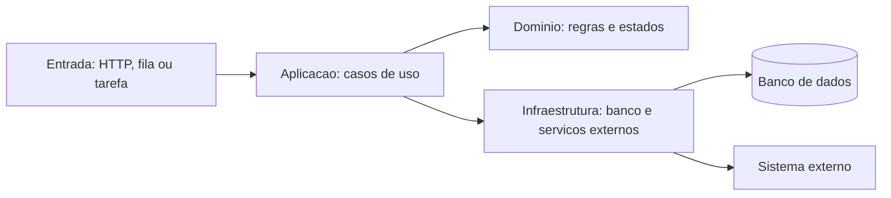
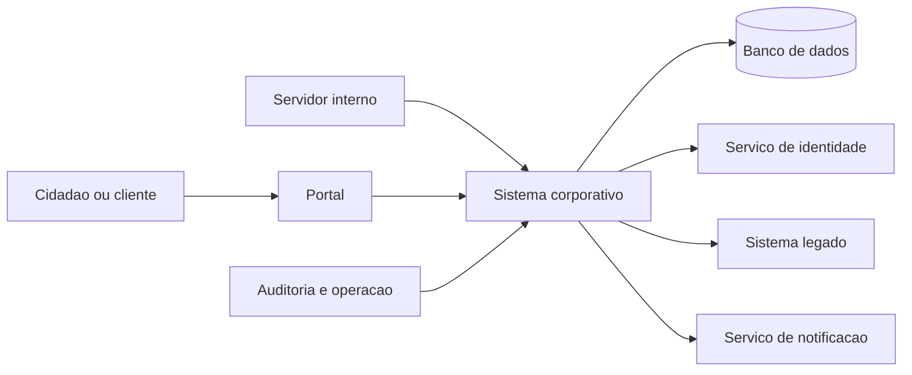
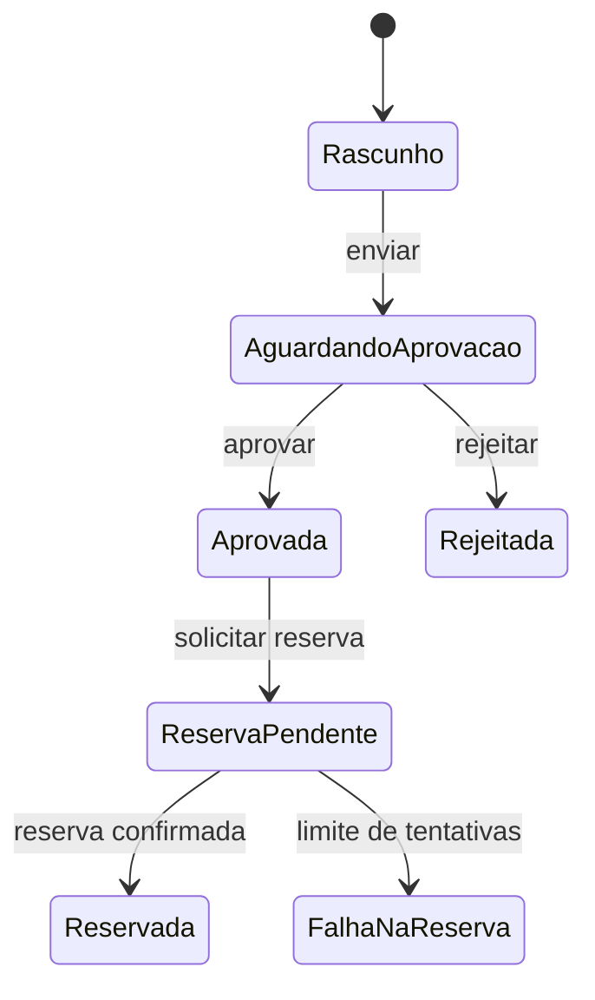

# Encontro 01

## Tema

Introdução aos sistemas corporativos: características, processos, atores,
integrações e requisitos não funcionais.

## Objetivos

- Apresentar a disciplina, sua relação com Desenvolvimento Web Backend e os produtos esperados.
- Definir sistema corporativo e distingui-lo de uma aplicação isolada.
- Identificar processos, atores, regras, dados e integrações de uma organização.
- Diferenciar requisitos funcionais e não funcionais.
- Reconhecer segurança, disponibilidade, integridade, rastreabilidade e evolução como preocupações centrais.
- Analisar um cenário corporativo e representar seu contexto.
- Relacionar processos e requisitos a decisões técnicas iniciais.
- Identificar falhas de integração, concorrência e consistência.
- Aplicar os conceitos na análise de um processo organizacional conhecido.

## Visão geral

Na disciplina anterior, o foco esteve na construção de uma aplicação backend:
receber requisições, validar dados, executar regras, persistir informações e
responder ao cliente. Nesta disciplina, a pergunta muda de escala.

Não basta perguntar se uma rota funciona. É preciso perguntar:

- qual processo organizacional depende dessa rota;
- quem pode executar a operação;
- quais sistemas precisam receber a informação;
- o que acontece quando uma dependência falha;
- como provar quem fez uma alteração;
- como manter o serviço disponível e evoluí-lo sem interromper o negócio.

Um sistema corporativo existe dentro de uma organização. Ele sustenta processos,
políticas e decisões e, normalmente, precisa conviver com vários usuários,
departamentos, bancos de dados, sistemas legados e serviços externos.

## Pergunta central

O que transforma uma aplicação Web funcional em um sistema capaz de sustentar
processos relevantes de uma organização?

## O que é um sistema corporativo?

Um sistema corporativo é uma solução de software que apoia ou automatiza
processos importantes de uma organização, preservando regras, dados e
responsabilidades ao longo do tempo.

Ele pode atender uma empresa, escola, hospital, órgão público, cooperativa ou
qualquer organização que dependa de informação para operar.

### Exemplos

- sistema acadêmico com matrículas, turmas, diários e históricos;
- sistema hospitalar com atendimento, prescrição, exames e faturamento;
- ERP com compras, estoque, financeiro e contabilidade;
- plataforma de chamados com filas, prazos e escalonamento;
- sistema de gestão de pessoas com contratos, frequência e folha;
- sistema logístico com pedidos, expedição, rastreamento e entrega.

### Uma aplicação pequena pode ser corporativa?

Sim. O tamanho do código não é o critério principal. Uma aplicação com poucas
telas pode ser crítica se controlar um processo importante, integrar dados ou
precisar cumprir regras legais. Da mesma forma, uma aplicação grande pode não
ser corporativa se for isolada e tiver baixo impacto organizacional.

## Aplicação isolada e sistema corporativo

| Aspecto | Aplicação isolada | Sistema corporativo |
|---|---|---|
| Escopo | tarefa específica | processo organizacional |
| Usuários | poucos perfis | diferentes papéis e responsabilidades |
| Dados | uso local | compartilhados, históricos e auditáveis |
| Integrações | opcionais | frequentes e relevantes |
| Indisponibilidade | impacto limitado | pode interromper o negócio |
| Evolução | mudanças simples | compatibilidade e migração são necessárias |
| Segurança | proteção básica | identidade, autorização e conformidade |
| Operação | execução da aplicação | monitoramento, suporte e resposta a falhas |

Essa comparação não cria duas categorias absolutas. Ela ajuda a perceber que a
complexidade corporativa surge das relações entre software, organização e tempo.

## Elementos de um sistema corporativo

### Processo

É uma sequência de atividades que produz um resultado para a organização.

Exemplo de compra:

1. servidor solicita um item;
2. chefia aprova a solicitação;
3. setor de compras realiza cotação;
4. fornecedor entrega o item;
5. almoxarifado registra o recebimento;
6. financeiro autoriza o pagamento.

### Ator

É uma pessoa, setor ou sistema que participa do processo. Um ator não é apenas
um usuário cadastrado; ele exerce uma responsabilidade em determinado contexto.

### Regra de negócio

É uma condição ou política do domínio.

Exemplos:

- compras acima de determinado valor exigem duas aprovações;
- uma matrícula depende da existência de vaga;
- somente o responsável pelo setor pode encerrar um chamado crítico;
- um pagamento não pode ser autorizado pelo próprio solicitante.

### Dado corporativo

É uma informação que precisa permanecer íntegra, compreensível e disponível.
Pode ter valor operacional, histórico, financeiro, estratégico ou legal.

### Integração

É a comunicação entre sistemas. Pode ocorrer por API, evento, fila, arquivo,
webhook ou até por uma base legada. Toda integração cria dependências e modos de
falha que precisam ser tratados.

## Da organização para a arquitetura

Os elementos organizacionais precisam aparecer na estrutura técnica. Uma forma
inicial de fazer essa tradução é separar responsabilidades:

| Elemento organizacional | Representação técnica possível |
|---|---|
| processo | caso de uso, workflow ou máquina de estados |
| ator e responsabilidade | identidade, papel e política de autorização |
| regra de negócio | serviço de aplicação, entidade ou política de domínio |
| dado corporativo | modelo persistente, restrição e histórico |
| integração | contrato de API, evento, adaptador ou consumidor de fila |
| evidência de execução | log estruturado, trilha de auditoria e métrica |

Essa correspondência não é automática. Uma tela, por exemplo, não deve ser a
única responsável por impedir uma aprovação indevida: a regra também precisa
ser aplicada no backend, pois outros clientes podem chamar a mesma operação.

### Fronteiras e camadas

Mesmo em uma aplicação pequena, é útil distinguir quatro responsabilidades:



- a entrada interpreta o protocolo, autentica a requisição e valida seu formato;
- a aplicação coordena o caso de uso e a transação;
- o domínio protege regras e transições válidas;
- a infraestrutura implementa persistência e comunicação externa.

Não se trata de exigir quatro projetos ou um framework específico. A separação
serve para evitar que regras críticas fiquem espalhadas por controllers, telas
e consultas ao banco.

## Visão de contexto



O diagrama mostra que o backend não opera sozinho. Alterar um contrato, um
identificador ou uma regra pode afetar canais, equipes e sistemas externos.

## Requisitos funcionais

Descrevem capacidades e comportamentos observáveis do sistema.

Exemplos:

- cadastrar uma solicitação de compra;
- aprovar ou rejeitar uma solicitação;
- consultar o histórico de alterações;
- emitir um relatório mensal;
- notificar o solicitante após a decisão.

Uma forma simples de escrevê-los é:

> Como responsável pelo setor, quero aprovar uma solicitação para permitir que o
> processo de compra prossiga.

## Requisitos não funcionais

Definem qualidades e restrições sob as quais as funções devem operar.

| Qualidade | Pergunta prática |
|---|---|
| Segurança | quem pode ver ou alterar cada informação? |
| Disponibilidade | por quanto tempo o sistema pode ficar indisponível? |
| Desempenho | quanto tempo uma operação pode levar? |
| Integridade | como impedir estados inválidos ou perda de dados? |
| Rastreabilidade | é possível saber quem fez cada alteração? |
| Interoperabilidade | como o sistema troca dados com outros? |
| Escalabilidade | o sistema suporta aumento de carga? |
| Manutenibilidade | uma mudança pode ser feita com risco controlado? |
| Conformidade | quais leis, políticas e prazos devem ser cumpridos? |

Essas qualidades frequentemente entram em tensão. Aumentar segurança pode
adicionar etapas ao processo; aumentar disponibilidade pode elevar custos. O
trabalho arquitetural consiste em tornar esses trade-offs explícitos.

### Tornando qualidades verificáveis

Um requisito como “o sistema deve ser rápido e seguro” não permite teste nem
orienta uma decisão. Requisitos de qualidade ficam mais úteis quando indicam
contexto, medida e limite.

| Formulação vaga | Formulação verificável |
|---|---|
| o sistema deve ser rápido | 95% das consultas devem responder em até 500 ms sob 100 requisições por segundo |
| o sistema deve estar disponível | o serviço deve atingir 99,9% de disponibilidade mensal, exceto manutenção programada |
| alterações devem ser auditadas | toda decisão deve registrar ator, instante, operação, alvo e resultado |
| os dados devem ser seguros | somente chefias do setor podem decidir solicitações, com acesso negado registrado |

Os valores são exemplos e precisam nascer do impacto para o negócio. Eles
também permitem definir testes, alertas e acordos de nível de serviço.

## Consistência e transações

Processos corporativos alteram dados relacionados. Ao aprovar uma solicitação,
por exemplo, o sistema pode precisar mudar seu estado, registrar a decisão e
reservar orçamento. Se apenas parte dessas operações ocorrer, o processo fica
inconsistente.

Em um único banco relacional, uma transação pode garantir que todas as mudanças
sejam confirmadas ou todas sejam desfeitas. Quando há outro sistema envolvido,
uma única transação normalmente não cobre tudo. Nesse caso, são necessárias
estratégias como:

- idempotência, para repetir uma operação sem produzir efeitos duplicados;
- retentativas com limite e espaçamento;
- registro do estado da integração;
- compensação ou intervenção manual quando não for possível desfazer;
- reconciliação periódica entre os sistemas.

Essas decisões derivam do processo: é preciso saber quais inconsistências são
temporariamente aceitáveis e quais impedem a operação.

## Contratos e formas de integração

Uma chamada síncrona por HTTP fornece resposta imediata, mas deixa o processo
dependente da disponibilidade e do tempo de resposta do serviço chamado. Uma
mensagem assíncrona reduz esse acoplamento temporal, porém exige lidar com
atrasos, duplicidade, ordenação e processamento posterior.

Todo contrato de integração deve explicitar, ao menos:

- formato e significado dos campos;
- identificador da operação para correlação e idempotência;
- autenticação e autorização entre os sistemas;
- erros esperados, timeout e política de retentativa;
- versionamento e compatibilidade durante mudanças.

Escolher API, fila ou evento depende da necessidade do processo, e não apenas da
tecnologia disponível.

## Identidade, autorização e auditoria

Três perguntas diferentes precisam ser respondidas:

1. **Autenticação:** quem está realizando a operação?
2. **Autorização:** essa identidade pode executar a operação neste recurso e
   neste estado do processo?
3. **Auditoria:** qual evidência precisa permanecer após a operação?

Um papel genérico como `ADMIN` raramente expressa toda a regra. Na solicitação
de compras, a decisão pode depender do setor, do valor, do estado atual e da
separação entre quem solicita e quem aprova. A autorização deve ser verificada
no servidor em cada operação protegida.

Auditoria também não é o mesmo que log de diagnóstico. Logs ajudam a investigar
o funcionamento da aplicação e podem ser descartados conforme uma política de
retenção. Uma trilha de auditoria é evidência de negócio, com acesso restrito,
integridade e prazo de retenção definidos.

## Operação e observabilidade

Um sistema corporativo precisa fornecer sinais que permitam detectar e explicar
falhas. Os três sinais mais comuns são:

- **logs:** registros estruturados de ocorrências, com identificador de
  correlação e sem dados sensíveis desnecessários;
- **métricas:** valores agregados, como taxa de erros, latência e tamanho de
  filas;
- **traces:** percurso de uma requisição entre componentes e integrações.

Um endpoint responder `200 OK` não prova que o processo terminou. A notificação
pode ter falhado ou a reserva orçamentária pode continuar pendente. Por isso,
métricas técnicas devem ser combinadas com indicadores do processo, como
“solicitações aguardando integração há mais de 10 minutos”.

## Estudo de caso: solicitação de compras

Considere uma instituição que atualmente recebe pedidos por mensagens e
planilhas. Informações são duplicadas, aprovações se perdem e não há uma visão
confiável do orçamento comprometido.

O novo sistema deverá:

- cadastrar solicitações com itens e justificativa;
- encaminhar a solicitação para a chefia correta;
- exigir aprovação adicional acima de um limite;
- consultar disponibilidade orçamentária em outro sistema;
- notificar o solicitante;
- manter histórico das decisões;
- permitir auditoria sem expor dados indevidos.

### Modelo técnico inicial

Uma solicitação pode começar com os estados abaixo:



As transições são regras: não basta receber qualquer texto no campo `status`.
O caso de uso deve validar o estado atual, a permissão do ator e as condições de
negócio antes de registrar a mudança.

Um contrato HTTP inicial poderia expor comandos e consultas distintos:

```http
POST /solicitacoes
POST /solicitacoes/42/envio
POST /solicitacoes/42/aprovacoes
GET  /solicitacoes/42
GET  /solicitacoes/42/historico
```

Exemplo de comando de aprovação:

```json
{
  "decisao": "APROVAR",
  "justificativa": "Valor e centro de custo conferidos"
}
```

No backend, a operação precisa ocorrer como uma unidade lógica:

```text
autenticar ator
  -> carregar solicitação e versão atual
  -> verificar autorização e estado
  -> registrar decisão e alterar estado em transação
  -> publicar ou agendar integração orçamentária
  -> devolver resultado com identificador de correlação
```

O campo de versão pode apoiar controle de concorrência otimista, impedindo que
duas decisões simultâneas sobrescrevam uma à outra silenciosamente.

### Cenários de falha para discussão

- a aprovação foi salva, mas o sistema orçamentário está indisponível;
- duas chefias tentam decidir a mesma solicitação ao mesmo tempo;
- o cliente repete a requisição após um timeout;
- o evento de aprovação é entregue duas vezes;
- um usuário consulta o histórico de outro setor;
- dados pessoais aparecem integralmente em logs.

Para cada cenário, a turma deve identificar impacto, forma de detecção e uma
estratégia de tratamento.

## Atividade prática: mapa técnico do processo

Em grupos, escolha um processo organizacional conhecido, como matrícula,
atendimento, compra, chamado ou empréstimo. Produza um documento curto contendo:

1. objetivo e início/fim do processo;
2. atores e responsabilidades;
3. entidades principais e estados relevantes;
4. pelo menos três regras de negócio;
5. uma integração e seu modo de falha;
6. dois requisitos funcionais;
7. três requisitos não funcionais mensuráveis;
8. um diagrama de contexto;
9. uma decisão técnica inicial acompanhada de sua justificativa.

### Critérios de verificação

- os atores representam responsabilidades, não apenas nomes de telas;
- estados e transições impedem situações inválidas;
- requisitos não funcionais possuem medida ou condição observável;
- o diagrama mostra a fronteira do sistema e suas dependências;
- a decisão técnica responde a uma necessidade identificada no processo.

**Saída esperada:** mapa técnico de uma página, entregue no repositório da
equipe e usado como insumo para os próximos encontros.

## Erros conceituais comuns

### Confundir sistema corporativo com ERP

ERP é uma categoria de sistema corporativo, mas não é a única.

### Começar pela tecnologia

Escolher banco, framework ou microsserviços antes de compreender o processo
torna decisões técnicas desconectadas do problema.

### Tratar requisito não funcional como detalhe

Segurança, disponibilidade e auditoria alteram a arquitetura e não devem ser
adicionadas apenas no final.

### Ignorar pessoas e responsabilidades

O sistema automatiza parte de um processo, mas decisões e exceções continuam
envolvendo atores organizacionais.

## Questões para revisão

1. O que diferencia um sistema corporativo de uma aplicação isolada?
2. Como processo, regra de negócio e ator se relacionam?
3. Por que integrações aumentam a complexidade do sistema?
4. Dê um exemplo de requisito funcional e um não funcional para o mesmo caso.
5. Por que rastreabilidade pode ser tão importante quanto desempenho?
6. Qual requisito não funcional você priorizaria em um sistema hospitalar?
7. Quando uma integração assíncrona pode ser preferível a uma chamada HTTP?
8. Como idempotência e controle de concorrência evitam inconsistências?

## Checklist de aprendizagem

Ao final do encontro, verifique se você consegue afirmar:

- Sei explicar o que é um sistema corporativo.
- Consigo identificar processo, atores, regras, dados e integrações.
- Distingo requisitos funcionais e não funcionais.
- Consigo representar o contexto básico de uma solução.
- Consigo transformar uma qualidade desejada em um requisito verificável.
- Consigo apontar riscos técnicos em transações e integrações.
- Entendo que decisões arquiteturais respondem a necessidades organizacionais.

## Resumo final

Sistemas corporativos sustentam processos e conectam pessoas, regras, dados e
outros sistemas. Sua complexidade não depende apenas da quantidade de código,
mas do impacto organizacional, das integrações, dos requisitos não funcionais e
da necessidade de evoluir com segurança. Essa visão será usada para analisar
todas as decisões técnicas dos próximos encontros.

## Material complementar

- `docs/visao-geral-disciplina.md`
- `docs/ementa-e-objetivos.md`
- `docs/cronograma-semestral.md`
- `projetos/projeto-final.md`
- Martin Fowler, *Patterns of Enterprise Application Architecture*.
- C4 Model: https://c4model.com/
