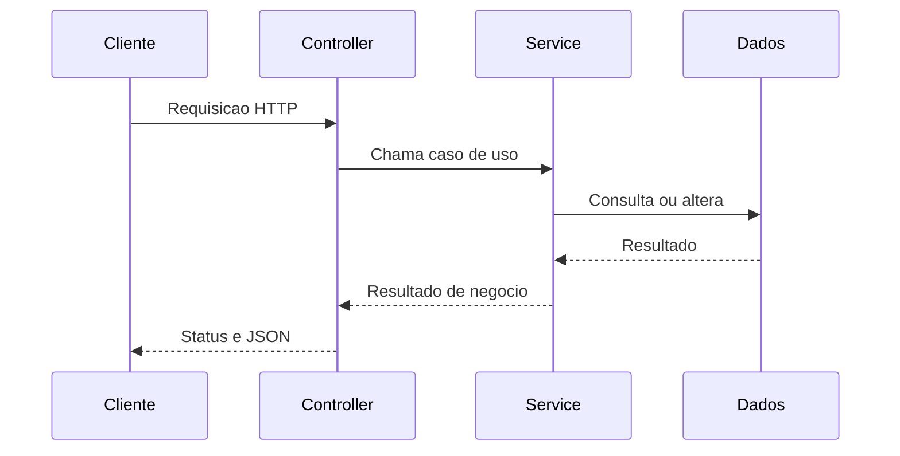
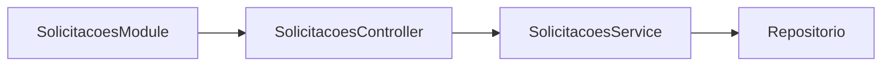

# Encontro 02

## Tema

Síntese dos encontros 1–15 de Desenvolvimento Web Backend: HTTP, NestJS,
rotas, validação, tratamento de dados, upload, cookies e sessão.

## Objetivos

- Recuperar os conceitos necessários para iniciar Sistemas Corporativos.
- Relacionar HTTP, rotas e códigos de status aos contratos de uma API.
- Revisar módulos, controllers, services e injeção de dependência no NestJS.
- Retomar DTOs, pipes, validação, filtros e tratamento de erros.
- Revisar formulários, serialização, upload, cookies e sessão.
- Diagnosticar lacunas técnicas sem repetir integralmente a disciplina anterior.
- Preparar uma API-base para os encontros de segurança e persistência.

## Projeto usado nos exemplos

Os exemplos consideram uma API NestJS dos encontros anteriores ou uma aplicação
mínima com ao menos um módulo de recurso. A execução local utiliza:

```bash
npm install
npm run start:dev
```

O ambiente técnico é composto por:

- Node.js LTS e npm;
- editor de código;
- `curl`, Insomnia, Postman ou Thunder Client;
- Git;
- projeto NestJS funcional.

## Visão geral

Este encontro não pretende repetir quinze aulas em 90 minutos. Seu objetivo é
reativar o modelo mental e verificar se a turma possui a base necessária para
avançar. Os detalhes serão recuperados durante o laboratório sempre que forem
necessários.

A disciplina anterior percorreu uma sequência:

```text
HTTP e cliente-servidor
        ↓
estrutura do NestJS
        ↓
rotas e entrada de dados
        ↓
validação e erros
        ↓
formulários, arquivos, cookies e sessão
```

O próximo passo é comprovar identidade, autorizar operações, persistir dados e
projetar a aplicação para um contexto corporativo.

## Pergunta central

Quais fundamentos de Backend precisam estar sólidos para que possamos evoluir
uma API para um sistema corporativo seguro, persistente e integrável?

## Mapa dos encontros 1–15

| Encontros anteriores | Conteúdo essencial | Evidência esperada |
|---|---|---|
| 1–3 | backend, HTTP, cliente-servidor e frameworks | explicar o percurso de uma requisição |
| 4–5 | ambiente, módulos, controllers e services | localizar responsabilidades no projeto |
| 6–9 | rotas, parâmetros, query, CRUD, PATCH e erros | testar operações com status coerentes |
| 10–12 | DTOs, pipes, validação e filtros | rejeitar entradas inválidas de forma padronizada |
| 13–15 | formulários, serialização, upload, cookies e sessão | tratar diferentes entradas e estado temporário |

## Revisão 1: ciclo cliente-servidor

Uma interação Web começa quando um cliente envia uma requisição HTTP. O servidor
interpreta o método, a rota, os cabeçalhos e o corpo, executa uma operação e
produz uma resposta.



### Anatomia de uma requisição

```http
PATCH /solicitacoes/42?notificar=true HTTP/1.1
Host: api.exemplo.local
Content-Type: application/json
Cookie: sessionId=abc123

{
  "justificativa": "Correção do centro de custo"
}
```

Elementos:

- método: `PATCH`;
- rota: `/solicitacoes/42`;
- parâmetro de rota: `42`;
- query string: `notificar=true`;
- cabeçalho: `Content-Type`;
- cookie: `sessionId`;
- corpo: objeto JSON.

### Métodos e intenção

| Método | Intenção típica | Exemplo |
|---|---|---|
| `GET` | consultar | `GET /solicitacoes` |
| `POST` | criar ou disparar comando | `POST /solicitacoes` |
| `PUT` | substituir representação | `PUT /solicitacoes/42` |
| `PATCH` | alterar parcialmente | `PATCH /solicitacoes/42` |
| `DELETE` | remover | `DELETE /solicitacoes/42` |

### Status não é decoração

| Código | Situação |
|---|---|
| `200` | consulta ou alteração concluída |
| `201` | recurso criado |
| `204` | sucesso sem corpo |
| `400` | entrada ou sintaxe inválida |
| `401` | identidade não comprovada |
| `403` | identidade sem permissão |
| `404` | recurso inexistente |
| `409` | conflito com o estado atual |
| `422` | regra aplicável, mas conteúdo semanticamente inválido |
| `500` | falha inesperada no servidor |

## Revisão 2: organização do NestJS

### Module

Agrupa componentes relacionados e explicita importações e exportações.

### Controller

Traduz HTTP para chamadas da aplicação. Deve permanecer pequeno: extrai dados,
aciona um serviço e devolve a resposta.

### Service

Coordena regras ou casos de uso. Não deve depender de detalhes do protocolo HTTP
quando a regra puder ser expressa no domínio.

### Injeção de dependência

Permite que uma classe receba suas dependências, favorecendo substituição,
testes e menor acoplamento.



### Exemplo revisado

```ts
@Controller('solicitacoes')
export class SolicitacoesController {
  constructor(private readonly service: SolicitacoesService) {}

  @Get(':id')
  buscar(@Param('id', ParseIntPipe) id: number) {
    return this.service.buscarPorId(id);
  }
}
```

O controller conhece rota e pipe. A busca pertence ao service.

```ts
@Injectable()
export class SolicitacoesService {
  buscarPorId(id: number) {
    const solicitacao = this.itens.find((item) => item.id === id);

    if (!solicitacao) {
      throw new NotFoundException('Solicitação não encontrada');
    }

    return solicitacao;
  }
}
```

## Revisão 3: entrada e validação

Uma API não deve confiar na entrada do cliente. Tipos TypeScript desaparecem em
tempo de execução; por isso DTOs e validação precisam atuar sobre o payload real.

```ts
export class CriarSolicitacaoDto {
  @IsString()
  @MinLength(10)
  justificativa: string;

  @IsInt()
  @Min(1)
  quantidade: number;
}
```

Configuração global típica:

```ts
app.useGlobalPipes(
  new ValidationPipe({
    whitelist: true,
    forbidNonWhitelisted: true,
    transform: true,
  }),
);
```

### Responsabilidade de cada mecanismo

| Mecanismo | Responsabilidade |
|---|---|
| DTO | declarar a forma esperada da entrada |
| decorator de validação | expressar restrições de campo |
| pipe | transformar ou validar antes do controller |
| exception | representar uma falha conhecida |
| filter | padronizar como falhas chegam ao cliente |
| interceptor | atuar antes/depois da execução, sem substituir regra de negócio |

## Revisão 4: formulários, upload e serialização

Formulários podem enviar `application/json`,
`application/x-www-form-urlencoded` ou `multipart/form-data`. Uploads exigem
limites de tamanho, tipos permitidos, nomes seguros e armazenamento adequado.

Nunca se deve assumir que:

- a extensão comprova o tipo real do arquivo;
- o nome enviado é seguro;
- o disco local do servidor é persistente;
- qualquer usuário pode acessar qualquer arquivo.

Serialização controla o que sai da API. Senhas, tokens internos e campos
restritos não devem aparecer na resposta apenas porque existem no objeto.

## Revisão 5: cookies e sessão

Cookie é um dado armazenado pelo cliente e enviado em requisições compatíveis.
Sessão é um estado mantido pelo servidor e normalmente associado a um
identificador presente em cookie.

```text
Cliente recebe cookie de sessão
        ↓
Cliente reenvia o identificador
        ↓
Servidor recupera o estado associado
```

Uma sessão anônima não comprova identidade. Essa distinção prepara o encontro 3:
autenticação é o processo que valida quem o usuário afirma ser.

## Estudo aplicado: revisão de uma API

### Cenário

A API de solicitações possui uma rota que aceita qualquer corpo, devolve sempre
`200` e mistura acesso HTTP com a regra de busca.

```ts
@Controller('solicitacoes')
export class SolicitacoesController {
  private itens = [];

  @Post()
  criar(@Body() body: any) {
    const item = { id: Date.now(), ...body };
    this.itens.push(item);
    return item;
  }
}
```

### 1. Contrato de entrada

O DTO define `titulo` com pelo menos três caracteres, `justificativa` com pelo
menos dez e `quantidade` inteira maior que zero.

### 2. Separação de responsabilidades

A coleção e a criação passam para um service injetável.

### 3. Contrato HTTP

A criação utiliza `201`, enquanto entradas inválidas produzem status e mensagens
coerentes.

### 4. Consulta por identificador

`GET /solicitacoes/:id` converte o identificador e produz `404` quando o item não
existe.

### 5. Casos relevantes

A verificação contempla:

1. criação válida;
2. campo extra rejeitado;
3. quantidade inválida;
4. identificador não numérico;
5. solicitação inexistente.

## Exemplo de testes manuais

```bash
curl -i -X POST http://localhost:3000/solicitacoes \
  -H 'Content-Type: application/json' \
  -d '{"titulo":"Notebook","justificativa":"Equipamento para o setor","quantidade":2}'
```

```bash
curl -i http://localhost:3000/solicitacoes/999
```

## Resultado da refatoração

- API executando sem erros;
- controller separado do service;
- DTO e `ValidationPipe` configurados;
- rotas de criação e busca funcionando;
- cinco evidências de teste;
- um commit identificado como revisão dos fundamentos.

## Erros comuns

### Usar `any` como solução permanente

Isso elimina proteção estática e costuma esconder contratos incompletos.

### Colocar toda a regra no controller

O controller fica difícil de testar e acopla a regra ao transporte HTTP.

### Retornar sempre `200`

Clientes dependem da semântica dos status para reagir corretamente.

### Confundir sessão com autenticação

Sessão guarda estado; autenticação comprova identidade.

### Confiar somente no frontend

Qualquer cliente pode chamar a API diretamente. A validação do backend é
obrigatória.

## Questões para revisão

1. Onde termina a responsabilidade do controller e começa a do service?
2. Por que um DTO TypeScript sozinho não valida o corpo recebido?
3. Qual diferença existe entre parâmetro de rota, query string e corpo?
4. Quando usar `401`, `403`, `404` e `409`?
5. Por que uploads exigem controles adicionais?
6. O que uma sessão oferece e o que ela não oferece?

## Checklist de aprendizagem

- Consigo explicar o ciclo de uma requisição.
- Reconheço os principais métodos e status HTTP.
- Sei localizar module, controller e service em um projeto NestJS.
- Sei validar DTOs e tratar recursos inexistentes.
- Distingo JSON, formulário e multipart.
- Distingo cookie, sessão e autenticação.
- Minha API-base está pronta para receber o módulo de autenticação.

## Resumo final

Os encontros 1–15 de Backend construíram o vocabulário e as técnicas sobre os
quais esta disciplina se apoia. O laboratório confirmou que a turma consegue
organizar uma API, validar entradas e comunicar erros corretamente. A partir do
próximo encontro, essa base será ampliada com autenticação e autorização.

## Material complementar

- Repositório-base: https://github.com/luciano-alexandre/desen-web-backend
- NestJS Controllers: https://docs.nestjs.com/controllers
- NestJS Providers: https://docs.nestjs.com/providers
- NestJS Validation: https://docs.nestjs.com/techniques/validation
- MDN HTTP: https://developer.mozilla.org/en-US/docs/Web/HTTP
