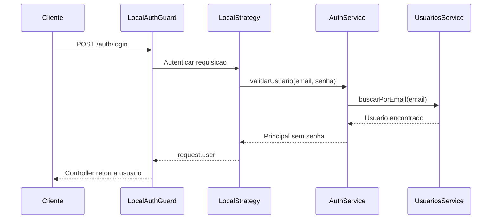

# Encontro 03

## Tema

Autenticação local e autorização em NestJS com Passport.

## Objetivos

- Diferenciar identificação, autenticação e autorização.
- Compreender credenciais, principal autenticado, estratégia e guard.
- Organizar módulos de usuários e autenticação com responsabilidades distintas.
- Implementar validação de credenciais em um service.
- Configurar autenticação local com Passport no NestJS.
- Evitar exposição de senha na resposta.
- Diferenciar respostas `401 Unauthorized` e `403 Forbidden`.
- Reconhecer os limites da autenticação local antes da adoção de JWT.

## Projeto usado nos exemplos

Os exemplos partem da API-base do encontro 2, com `ValidationPipe` global. A
aplicação será executada em um contêiner Docker e ficará disponível no host em
`http://localhost:3000`. As requisições serão realizadas pela extensão Thunder
Client do VS Code.

Ferramentas necessárias:

- Docker com o comando `docker compose`;
- Visual Studio Code;
- extensão Thunder Client instalada no VS Code.

Dependências usadas no projeto:

```bash
docker compose run --rm api npm install @nestjs/passport passport passport-local
docker compose run --rm api npm install -D @types/passport-local
```

Esses comandos pressupõem os arquivos Docker apresentados a seguir e atualizam
`package.json` e `package-lock.json` por meio do contêiner, sem exigir Node.js ou
npm instalados diretamente na máquina.

Neste encontro, os usuários serão mantidos em memória para concentrar a aula no
fluxo de autenticação. Hash de senha, JWT e persistência serão tratados depois.

## Execução do projeto com Docker

Crie um arquivo `Dockerfile` na raiz do projeto:

```dockerfile
FROM node:22-alpine

WORKDIR /app

COPY package*.json ./
RUN npm ci

COPY . .

EXPOSE 3000

CMD ["npm", "run", "start:dev"]
```

Crie também `compose.yaml` na raiz:

```yaml
services:
  api:
    build: .
    ports:
      - "3000:3000"
    volumes:
      - .:/app
      - node_modules:/app/node_modules
    command: npm run start:dev

volumes:
  node_modules:
```

O primeiro volume permite que alterações no código sejam percebidas pelo modo
de desenvolvimento do NestJS. O volume nomeado preserva as dependências do
contêiner e evita que uma pasta `node_modules` do host as sobrescreva.

Depois de instalar as dependências de autenticação, construa e inicie a API:

```bash
docker compose up --build
```

Mantenha esse terminal aberto durante os testes. A saída deve indicar que o
NestJS está ouvindo na porta `3000`. Para encerrar, pressione `Ctrl+C` e execute:

```bash
docker compose down
```

## Visão geral

Até aqui, a API recebeu dados e conseguiu manter algum estado. Ainda falta
responder a duas perguntas fundamentais:

1. Quem está realizando a requisição?
2. Essa pessoa pode executar a operação solicitada?

Autenticação responde à primeira pergunta. Autorização responde à segunda. Em
sistemas corporativos, confundir essas etapas pode permitir que um usuário
autenticado execute ações incompatíveis com sua responsabilidade.

## Pergunta central

Como comprovar a identidade em uma API NestJS sem misturar credenciais,
transporte HTTP e regras de usuário dentro do controller?

## Conceitos fundamentais

### Identificação

É a declaração de uma identidade.

```json
{ "email": "ana@empresa.com" }
```

O e-mail indica qual conta a pessoa afirma usar, mas não comprova sua identidade.

### Autenticação

É a verificação de uma credencial associada à identidade declarada.

```json
{
  "email": "ana@empresa.com",
  "senha": "segredo-temporario"
}
```

### Autorização

É a decisão sobre o que uma identidade autenticada pode fazer.

Exemplos:

- solicitante cria e consulta suas solicitações;
- gestor aprova solicitações de sua unidade;
- auditor consulta histórico, mas não altera decisões;
- administrador gerencia cadastros, mas não aprova em nome do gestor.

### Credencial

É uma evidência usada na autenticação: senha, token, certificado, chave de API
ou código temporário. Credenciais precisam ser protegidas durante transmissão,
armazenamento e uso.

### Principal autenticado

É a representação segura da identidade reconhecida pela aplicação.

```json
{
  "id": 7,
  "nome": "Ana Lima",
  "email": "ana@empresa.com",
  "papel": "gestor"
}
```

A senha não faz parte dessa representação.

## `401` e `403`

| Status | Significado prático | Exemplo |
|---|---|---|
| `401 Unauthorized` | identidade não foi comprovada | senha inválida ou token ausente |
| `403 Forbidden` | identidade foi comprovada, mas não tem permissão | solicitante tenta aprovar compra |

Apesar do nome histórico de `401`, ele representa falha ou ausência de
autenticação. `403` representa negação de autorização.

## Fluxo da autenticação local



### Papel do Passport

Passport padroniza estratégias de autenticação. A integração do NestJS permite:

- declarar uma estratégia;
- acionar essa estratégia por um guard;
- interromper a requisição quando a credencial for inválida;
- preencher `request.user` após sucesso.

Passport não define sozinho como os usuários são armazenados nem quais regras
de autorização serão aplicadas.

## Estrutura proposta

```text
src/
├── auth/
│   ├── guards/
│   │   └── local-auth.guard.ts
│   ├── strategies/
│   │   └── local.strategy.ts
│   ├── auth.controller.ts
│   ├── auth.module.ts
│   └── auth.service.ts
└── usuarios/
    ├── usuarios.module.ts
    └── usuarios.service.ts
```

O módulo de usuários localiza e representa contas. O módulo de autenticação
valida credenciais e controla o fluxo de login.

## Passo 1 — Criar o serviço de usuários

```ts
import { Injectable } from '@nestjs/common';

export type Usuario = {
  id: number;
  nome: string;
  email: string;
  senha: string;
  papel: 'solicitante' | 'gestor';
  ativo: boolean;
};

@Injectable()
export class UsuariosService {
  private readonly usuarios: Usuario[] = [
    {
      id: 1,
      nome: 'Ana Lima',
      email: 'ana@empresa.com',
      senha: '123456',
      papel: 'gestor',
      ativo: true,
    },
  ];

  buscarPorEmail(email: string) {
    return this.usuarios.find((usuario) => usuario.email === email);
  }
}
```

Senha em texto puro aparece apenas para permitir a compreensão do fluxo. Isso é
inseguro e será corrigido no encontro 4.

## Passo 2 — Validar credenciais no `AuthService`

```ts
import { Injectable } from '@nestjs/common';
import { UsuariosService } from '../usuarios/usuarios.service';

@Injectable()
export class AuthService {
  constructor(private readonly usuariosService: UsuariosService) {}

  async validarUsuario(email: string, senha: string) {
    const usuario = this.usuariosService.buscarPorEmail(email);

    if (!usuario || !usuario.ativo || usuario.senha !== senha) {
      return null;
    }

    const { senha: _senha, ...principal } = usuario;
    return principal;
  }
}
```

Pontos importantes:

- a resposta é a mesma para usuário inexistente e senha incorreta;
- conta inativa não autentica;
- a senha é removida antes do retorno;
- o controller não compara credenciais.

## Passo 3 — Configurar a estratégia local

```ts
import { Injectable, UnauthorizedException } from '@nestjs/common';
import { PassportStrategy } from '@nestjs/passport';
import { Strategy } from 'passport-local';
import { AuthService } from '../auth.service';

@Injectable()
export class LocalStrategy extends PassportStrategy(Strategy) {
  constructor(private readonly authService: AuthService) {
    super({ usernameField: 'email', passwordField: 'senha' });
  }

  async validate(email: string, senha: string) {
    const usuario = await this.authService.validarUsuario(email, senha);

    if (!usuario) {
      throw new UnauthorizedException('Credenciais inválidas');
    }

    return usuario;
  }
}
```

O valor retornado por `validate` será atribuído a `request.user`.

## Passo 4 — Criar o guard

```ts
import { Injectable } from '@nestjs/common';
import { AuthGuard } from '@nestjs/passport';

@Injectable()
export class LocalAuthGuard extends AuthGuard('local') {}
```

## Passo 5 — Expor o login

```ts
import { Controller, Post, Req, UseGuards } from '@nestjs/common';
import { LocalAuthGuard } from './guards/local-auth.guard';

@Controller('auth')
export class AuthController {
  @UseGuards(LocalAuthGuard)
  @Post('login')
  login(@Req() request: { user: unknown }) {
    return { usuario: request.user };
  }
}
```

O método não recebe e-mail e senha diretamente porque o guard já processou a
requisição. Se a autenticação falhar, o controller não será executado.

## Passo 6 — Montar os módulos

```ts
@Module({
  providers: [UsuariosService],
  exports: [UsuariosService],
})
export class UsuariosModule {}
```

```ts
@Module({
  imports: [UsuariosModule, PassportModule],
  controllers: [AuthController],
  providers: [AuthService, LocalStrategy, LocalAuthGuard],
})
export class AuthModule {}
```

Importe `AuthModule` no módulo principal da aplicação.

## Testes dos endpoints com Thunder Client

Com o contêiner em execução, abra o VS Code, selecione o ícone do Thunder Client
na barra lateral e clique em **New Request**.

### Login válido

Configure a requisição:

- método: `POST`;
- URL: `http://localhost:3000/auth/login`;
- aba **Body**: selecione **JSON**;
- corpo:

```json
{
  "email": "ana@empresa.com",
  "senha": "123456"
}
```

Clique em **Send**. O Thunder Client adicionará
`Content-Type: application/json` ao selecionar o corpo JSON.

Resultado esperado: status `201 Created`, que é o padrão de uma rota `POST` no
NestJS, e o corpo:

```json
{
  "usuario": {
    "id": 1,
    "nome": "Ana Lima",
    "email": "ana@empresa.com",
    "papel": "gestor",
    "ativo": true
  }
}
```

### Login inválido

Duplique a requisição anterior e altere apenas a senha:

```json
{
  "email": "ana@empresa.com",
  "senha": "errada"
}
```

Clique em **Send**. O resultado esperado é `401 Unauthorized`, sem revelar se
o e-mail existe.

Salve as duas requisições em uma coleção chamada **Encontro 03**. Antes de
versionar ou compartilhar a coleção, confirme que ela contém somente as
credenciais fictícias usadas na aula.

## Erros comuns

### Retornar o objeto completo do usuário

Isso pode expor senha e outros dados internos.

### Informar “usuário inexistente” no login

Mensagens diferentes facilitam enumeração de contas.

### Comparar senha no controller

Isso mistura HTTP com regra de autenticação e dificulta testes.

### Achar que o login protege todas as rotas

Sem um mecanismo enviado nas próximas requisições, a identidade não é mantida.

## Questões para revisão

1. Qual a diferença entre identificação, autenticação e autorização?
2. Qual componente coloca o principal em `request.user`?
3. Por que a senha deve ser removida do retorno?
4. Quando responder `401` e quando responder `403`?
5. Por que autenticação local ainda não protege uma rota futura?
6. Qual responsabilidade pertence ao módulo de usuários?

## Checklist de aprendizagem

- Distingo autenticação e autorização.
- Compreendo estratégia, guard e principal autenticado.
- Sei onde validar credenciais.
- Consigo implementar autenticação local com Passport.
- Consigo executar o projeto por meio do Docker Compose.
- Consigo testar os endpoints com o Thunder Client.
- Não exponho senha na resposta.
- Reconheço as limitações que serão resolvidas por hash e JWT.

## Resumo final

O encontro implementou a primeira comprovação de identidade da API. Passport,
estratégia, guard e services separaram as responsabilidades do fluxo de login.
A solução ainda é deliberadamente incompleta: no próximo encontro, as senhas
serão protegidas, tokens representarão a identidade entre requisições e papéis
serão usados para autorizar operações.

## Material complementar

- NestJS Authentication: https://docs.nestjs.com/security/authentication
- Passport: https://www.passportjs.org/
- OWASP Authentication Cheat Sheet: https://cheatsheetseries.owasp.org/cheatsheets/Authentication_Cheat_Sheet.html
