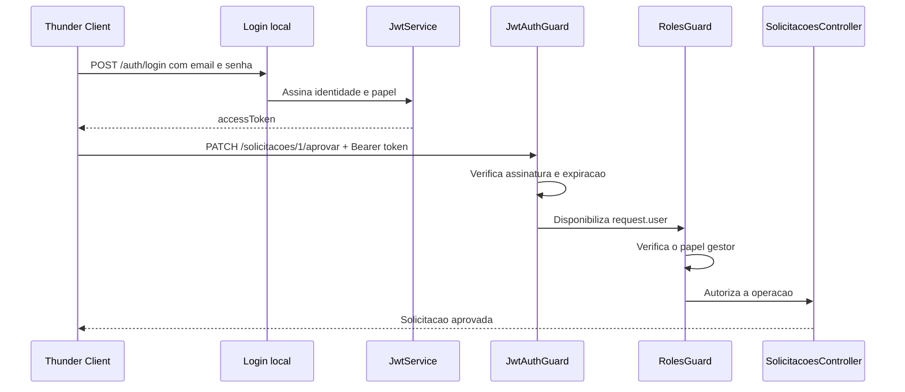

# Encontro 04

## Tema

JWT, hash de senha e autorização por papéis em NestJS com execução via Docker.

## Objetivos

- Dar continuidade ao projeto construído no encontro 3.
- Instalar e executar as dependências por meio do Docker Compose.
- Substituir senhas em texto puro por hashes com salt.
- Emitir e validar um JWT após a autenticação local.
- Implementar autorização por papéis com decorator e guard.
- Diferenciar, na prática, respostas `401 Unauthorized` e `403 Forbidden`.
- Preparar a API para a Prática 1 do encontro 5.

## Ponto de partida

Use a mesma pasta do projeto do encontro 3. Ela já deve conter:

- a API NestJS com `ValidationPipe` global;
- os módulos `usuarios` e `auth`;
- autenticação local com Passport;
- `Dockerfile` e `compose.yaml`;
- a rota `POST /auth/login` funcionando.

Não crie outra aplicação. Cada passo modifica o projeto anterior. Node.js e
npm não precisam estar instalados no host: os comandos serão executados no
serviço `api` do Docker Compose.

## Resultado esperado



## Passo 1 - Instalar as dependências no contêiner

Na raiz do projeto, execute:

```bash
docker compose run --rm api npm install @nestjs/jwt passport-jwt bcrypt
docker compose run --rm api npm install -D @types/passport-jwt @types/bcrypt
```

Os comandos atualizam `package.json` e `package-lock.json` pelo contêiner. O
volume `node_modules`, criado no encontro 3, mantém as dependências isoladas.

## Passo 2 - Configurar o ambiente no Docker

Crie `.env` na raiz do projeto:

```dotenv
JWT_SECRET=chave-local-apenas-para-o-laboratorio
JWT_EXPIRES_IN_SECONDS=900
```

O valor `900` corresponde a 15 minutos. Em um sistema real, o segredo deve ser
longo, aleatório, diferente por ambiente e armazenado com segurança.

Crie `.env.example`, que pode ser versionado:

```dotenv
JWT_SECRET=defina-um-segredo-no-arquivo-env
JWT_EXPIRES_IN_SECONDS=900
```

Confirme que `.env` está no `.gitignore`:

```gitignore
node_modules
dist
.env
```

Atualize o serviço `api` em `compose.yaml`:

```yaml
services:
  api:
    build: .
    ports:
      - "3000:3000"
    volumes:
      - .:/app
      - node_modules:/app/node_modules
    env_file:
      - .env
    command: npm run start:dev

volumes:
  node_modules:
```

`env_file` torna explícito que as variáveis chegarão ao processo NestJS dentro
do contêiner.

## Passo 3 - Substituir senhas por hashes

Um hash de senha não deve ser reversível. No cadastro, a aplicação calcula o
hash com salt; no login, compara a tentativa com o hash armazenado.

Para gerar um hash da senha didática `123456` pelo contêiner:

```bash
docker compose run --rm api node -e "require('bcrypt').hash('123456', 12).then(console.log)"
```

Cada execução produz um resultado diferente por causa do salt. Para tornar o
roteiro reproduzível, o código abaixo já traz um hash válido.

Substitua `src/usuarios/usuarios.service.ts` por:

```ts
import { Injectable } from '@nestjs/common';

export type Papel = 'solicitante' | 'gestor' | 'auditor';

export type Usuario = {
  id: number;
  nome: string;
  email: string;
  senhaHash: string;
  papel: Papel;
  ativo: boolean;
};

export type UsuarioAutenticado = Omit<Usuario, 'senhaHash'>;

@Injectable()
export class UsuariosService {
  private readonly usuarios: Usuario[] = [
    {
      id: 1,
      nome: 'Ana Lima',
      email: 'ana@empresa.com',
      senhaHash:
        '$2b$12$5S9LDbR3FznMAsZY5P..2OKE932dOHeVvGrmlfklgquClbkKgUidC',
      papel: 'gestor',
      ativo: true,
    },
    {
      id: 2,
      nome: 'Bruno Silva',
      email: 'bruno@empresa.com',
      senhaHash:
        '$2b$12$5S9LDbR3FznMAsZY5P..2OKE932dOHeVvGrmlfklgquClbkKgUidC',
      papel: 'solicitante',
      ativo: true,
    },
  ];

  buscarPorEmail(email: string) {
    return this.usuarios.find((usuario) => usuario.email === email);
  }
}
```

Os dois usuários usam a senha didática `123456`. Reutilizar senha ou hash não
é aceitável fora deste laboratório.

## Passo 4 - Comparar a senha e emitir o JWT

Substitua `src/auth/auth.service.ts` por:

```ts
import { Injectable } from '@nestjs/common';
import { JwtService } from '@nestjs/jwt';
import * as bcrypt from 'bcrypt';
import {
  UsuarioAutenticado,
  UsuariosService,
} from '../usuarios/usuarios.service';

@Injectable()
export class AuthService {
  constructor(
    private readonly usuariosService: UsuariosService,
    private readonly jwtService: JwtService,
  ) {}

  async validarUsuario(email: string, senha: string) {
    const usuario = this.usuariosService.buscarPorEmail(email);

    if (!usuario || !usuario.ativo) {
      return null;
    }

    const senhaValida = await bcrypt.compare(senha, usuario.senhaHash);

    if (!senhaValida) {
      return null;
    }

    const { senhaHash: _senhaHash, ...principal } = usuario;
    return principal;
  }

  login(usuario: UsuarioAutenticado) {
    const payload = {
      sub: usuario.id,
      email: usuario.email,
      papel: usuario.papel,
    };

    return {
      accessToken: this.jwtService.sign(payload),
    };
  }
}
```

O JWT é assinado, mas seu payload pode ser lido. Senha, hash e outros dados
sensíveis não devem ser incluídos.

## Passo 5 - Fazer o login devolver o token

Substitua `src/auth/auth.controller.ts` por:

```ts
import { Controller, Get, Post, Req, UseGuards } from '@nestjs/common';
import { UsuarioAutenticado } from '../usuarios/usuarios.service';
import { AuthService } from './auth.service';
import { JwtAuthGuard } from './guards/jwt-auth.guard';
import { LocalAuthGuard } from './guards/local-auth.guard';

type RequisicaoAutenticada = {
  user: UsuarioAutenticado;
};

@Controller('auth')
export class AuthController {
  constructor(private readonly authService: AuthService) {}

  @UseGuards(LocalAuthGuard)
  @Post('login')
  login(@Req() request: RequisicaoAutenticada) {
    return this.authService.login(request.user);
  }

  @UseGuards(JwtAuthGuard)
  @Get('perfil')
  perfil(@Req() request: RequisicaoAutenticada) {
    return request.user;
  }
}
```

O import de `JwtAuthGuard` ficará resolvido no próximo passo.

## Passo 6 - Criar a estratégia e o guard JWT

Crie `src/auth/strategies/jwt.strategy.ts`:

```ts
import { Injectable } from '@nestjs/common';
import { PassportStrategy } from '@nestjs/passport';
import { ExtractJwt, Strategy } from 'passport-jwt';
import { Papel } from '../../usuarios/usuarios.service';

type JwtPayload = {
  sub: number;
  email: string;
  papel: Papel;
};

@Injectable()
export class JwtStrategy extends PassportStrategy(Strategy) {
  constructor() {
    const secret = process.env.JWT_SECRET;

    if (!secret) {
      throw new Error('JWT_SECRET nao foi definido');
    }

    super({
      jwtFromRequest: ExtractJwt.fromAuthHeaderAsBearerToken(),
      ignoreExpiration: false,
      secretOrKey: secret,
    });
  }

  validate(payload: JwtPayload) {
    return {
      id: payload.sub,
      email: payload.email,
      papel: payload.papel,
    };
  }
}
```

Crie `src/auth/guards/jwt-auth.guard.ts`:

```ts
import { Injectable } from '@nestjs/common';
import { AuthGuard } from '@nestjs/passport';

@Injectable()
export class JwtAuthGuard extends AuthGuard('jwt') {}
```

A estratégia extrai o token de `Authorization: Bearer ...`, verifica assinatura
e expiração e disponibiliza seu retorno como `request.user`.

## Passo 7 - Atualizar o módulo de autenticação

Substitua `src/auth/auth.module.ts` por:

```ts
import { Module } from '@nestjs/common';
import { JwtModule } from '@nestjs/jwt';
import { PassportModule } from '@nestjs/passport';
import { UsuariosModule } from '../usuarios/usuarios.module';
import { AuthController } from './auth.controller';
import { AuthService } from './auth.service';
import { JwtAuthGuard } from './guards/jwt-auth.guard';
import { LocalAuthGuard } from './guards/local-auth.guard';
import { JwtStrategy } from './strategies/jwt.strategy';
import { LocalStrategy } from './strategies/local.strategy';

@Module({
  imports: [
    UsuariosModule,
    PassportModule,
    JwtModule.registerAsync({
      useFactory: () => {
        const secret = process.env.JWT_SECRET;

        if (!secret) {
          throw new Error('JWT_SECRET nao foi definido');
        }

        return {
          secret,
          signOptions: {
            expiresIn: Number(process.env.JWT_EXPIRES_IN_SECONDS ?? 900),
          },
        };
      },
    }),
  ],
  controllers: [AuthController],
  providers: [
    AuthService,
    LocalStrategy,
    JwtStrategy,
    LocalAuthGuard,
    JwtAuthGuard,
  ],
  exports: [JwtAuthGuard],
})
export class AuthModule {}
```

A aplicação falha ao iniciar sem `JWT_SECRET`, evitando o uso silencioso de
um segredo padrão fraco.

## Passo 8 - Criar o decorator de papéis

Crie `src/auth/decorators/roles.decorator.ts`:

```ts
import { SetMetadata } from '@nestjs/common';
import { Papel } from '../../usuarios/usuarios.service';

export const ROLES_KEY = 'roles';
export const Roles = (...roles: Papel[]) => SetMetadata(ROLES_KEY, roles);
```

O decorator registra quais papéis uma rota aceita. A decisão será feita pelo
guard.

## Passo 9 - Criar o guard de autorização

Crie `src/auth/guards/roles.guard.ts`:

```ts
import { CanActivate, ExecutionContext, Injectable } from '@nestjs/common';
import { Reflector } from '@nestjs/core';
import { Papel } from '../../usuarios/usuarios.service';
import { ROLES_KEY } from '../decorators/roles.decorator';

@Injectable()
export class RolesGuard implements CanActivate {
  constructor(private readonly reflector: Reflector) {}

  canActivate(context: ExecutionContext): boolean {
    const papeisExigidos = this.reflector.getAllAndOverride<Papel[]>(ROLES_KEY, [
      context.getHandler(),
      context.getClass(),
    ]);

    if (!papeisExigidos?.length) {
      return true;
    }

    const request = context.switchToHttp().getRequest();
    return papeisExigidos.includes(request.user?.papel);
  }
}
```

Adicione o import e inclua `RolesGuard` nos `providers` e `exports` de
`AuthModule`:

```ts
import { RolesGuard } from './guards/roles.guard';

// Dentro de @Module:
providers: [
  AuthService,
  LocalStrategy,
  JwtStrategy,
  LocalAuthGuard,
  JwtAuthGuard,
  RolesGuard,
],
exports: [JwtAuthGuard, RolesGuard],
```

## Passo 10 - Proteger a aprovação de solicitações

### 10.1 - Verificar ou criar o módulo de solicitações

O encontro 2 apresentou exemplos de um módulo de solicitações, mas não garantiu
a criação dos respectivos arquivos. Verifique se o projeto contém:

```text
src/solicitacoes/
├── solicitacoes.controller.ts
├── solicitacoes.module.ts
└── solicitacoes.service.ts
```

Se esses arquivos já existirem, preserve as rotas e regras implementadas e siga
para a seção 10.2. Caso ainda não existam, gere a estrutura pelo contêiner:

```bash
docker compose run --rm api npx nest generate module solicitacoes
docker compose run --rm api npx nest generate controller solicitacoes --no-spec
docker compose run --rm api npx nest generate service solicitacoes --no-spec
```

O Nest CLI adiciona `SolicitacoesModule` ao `AppModule`. Confirme essa importação
antes de continuar.

Para a versão mínima do laboratório, use em
`src/solicitacoes/solicitacoes.service.ts`:

```ts
import { Injectable, NotFoundException } from '@nestjs/common';

type StatusSolicitacao = 'pendente' | 'aprovada';

type Solicitacao = {
  id: number;
  titulo: string;
  status: StatusSolicitacao;
};

@Injectable()
export class SolicitacoesService {
  private readonly solicitacoes: Solicitacao[] = [
    { id: 1, titulo: 'Aquisição de notebook', status: 'pendente' },
  ];

  buscarPorId(id: number) {
    const solicitacao = this.solicitacoes.find((item) => item.id === id);

    if (!solicitacao) {
      throw new NotFoundException('Solicitação não encontrada');
    }

    return solicitacao;
  }

  aprovar(id: number) {
    const solicitacao = this.buscarPorId(id);
    solicitacao.status = 'aprovada';
    return solicitacao;
  }
}
```

Use em `src/solicitacoes/solicitacoes.controller.ts`:

```ts
import { Controller, Get, Param, ParseIntPipe } from '@nestjs/common';
import { SolicitacoesService } from './solicitacoes.service';

@Controller('solicitacoes')
export class SolicitacoesController {
  constructor(private readonly solicitacoesService: SolicitacoesService) {}

  @Get(':id')
  buscarPorId(@Param('id', ParseIntPipe) id: number) {
    return this.solicitacoesService.buscarPorId(id);
  }
}
```

Esses dados permanecem em memória porque a persistência será introduzida nos
encontros seguintes.

### 10.2 - Importar o módulo de autenticação

No `SolicitacoesModule`, importe `AuthModule`:

```ts
import { Module } from '@nestjs/common';
import { AuthModule } from '../auth/auth.module';
import { SolicitacoesController } from './solicitacoes.controller';
import { SolicitacoesService } from './solicitacoes.service';

@Module({
  imports: [AuthModule],
  controllers: [SolicitacoesController],
  providers: [SolicitacoesService],
})
export class SolicitacoesModule {}
```

### 10.3 - Acrescentar a rota protegida

Acrescente a rota ao `SolicitacoesController`:

```ts
@UseGuards(JwtAuthGuard, RolesGuard)
@Roles('gestor')
@Patch(':id/aprovar')
aprovar(@Param('id', ParseIntPipe) id: number) {
  return this.solicitacoesService.aprovar(id);
}
```

Acrescente os imports que ainda não existirem:

```ts
import { Param, ParseIntPipe, Patch, UseGuards } from '@nestjs/common';
import { Roles } from '../auth/decorators/roles.decorator';
import { JwtAuthGuard } from '../auth/guards/jwt-auth.guard';
import { RolesGuard } from '../auth/guards/roles.guard';
```

No `SolicitacoesService`, implemente ou adapte o método abaixo caso ele ainda
não tenha sido criado na seção 10.1:

```ts
aprovar(id: number) {
  const solicitacao = this.buscarPorId(id);
  solicitacao.status = 'aprovada';
  return solicitacao;
}
```

Se o tipo da solicitação ainda não tiver o campo, acrescente
`status: 'pendente' | 'aprovada'` e inicialize novas solicitações com
`status: 'pendente'`.

A ordem dos guards importa: `JwtAuthGuard` autentica e preenche `request.user`;
depois, `RolesGuard` verifica o papel.

## Passo 11 - Construir e iniciar o projeto

```bash
docker compose up --build
```

Mantenha o terminal aberto. A saída deve informar que o NestJS está ouvindo na
porta `3000`. Para encerrar ao final da aula:

```bash
docker compose down
```

## Passo 12 - Testar com Thunder Client

Crie uma coleção chamada **Encontro 04**.

### 1. Login do gestor

- método: `POST`;
- URL: `http://localhost:3000/auth/login`;
- Body, JSON:

```json
{
  "email": "ana@empresa.com",
  "senha": "123456"
}
```

Resultado esperado: `201 Created`:

```json
{
  "accessToken": "eyJ..."
}
```

### 2. Consultar o perfil

- método: `GET`;
- URL: `http://localhost:3000/auth/perfil`;
- Auth: **Bearer**, com o token de Ana.

Resultado esperado: `200 OK`:

```json
{
  "id": 1,
  "email": "ana@empresa.com",
  "papel": "gestor"
}
```

### 3. Acessar sem token

Duplique a requisição anterior e remova a autenticação. Resultado esperado:
`401 Unauthorized`, pois nenhuma identidade foi comprovada.

### 4. Aprovar como gestor

Garanta que exista uma solicitação de id `1` ou use o id criado na aula:

- método: `PATCH`;
- URL: `http://localhost:3000/solicitacoes/1/aprovar`;
- Auth: **Bearer**, com o token de Ana.

Resultado esperado: `200 OK` com `status` igual a `aprovada`.

### 5. Tentar aprovar como solicitante

Faça login com `bruno@empresa.com` e senha `123456`. Use o novo token na mesma
rota. Resultado esperado: `403 Forbidden`: Bruno foi autenticado, mas seu papel
não permite a operação.

### 6. Testar falhas

- senha incorreta no login: `401 Unauthorized`;
- token com um caractere alterado: `401 Unauthorized`;
- token usado depois da expiração: `401 Unauthorized`.

Não registre tokens válidos em commits, prints ou evidências entregues.

## Matriz mínima de testes

| Cenário | Resultado esperado |
|---|---|
| login válido | `201` com `accessToken` |
| senha inválida | `401` |
| perfil sem token | `401` |
| perfil com token válido | `200`, sem senha ou hash |
| token adulterado ou expirado | `401` |
| aprovação por gestor | `200` |
| aprovação por solicitante | `403` |

## Exercício 

Amplie a matriz de acesso da API sem alterar a regra de
aprovação já implementada.

1. Acrescente uma usuária ativa chamada `Carla`, com papel `auditor`, senha
   didática `123456` armazenada somente como hash e um e-mail diferente dos
   demais.
2. Proteja a rota `GET /solicitacoes/:id` com JWT e permita a consulta apenas
   aos papéis `gestor` e `auditor`.
3. Mantenha `PATCH /solicitacoes/:id/aprovar` acessível exclusivamente ao papel
   `gestor`.
4. Execute os casos abaixo e anote, para cada um, qual guard tomou a decisão.

| Caso | Resultado esperado |
|---|---|
| consulta sem token | `401 Unauthorized` |
| consulta com token de Bruno (`solicitante`) | `403 Forbidden` |
| consulta com token de Carla (`auditor`) | `200 OK` |
| aprovação com token de Carla (`auditor`) | `403 Forbidden` |
| aprovação com token de Ana (`gestor`) | `200 OK` |


## Conceitos consolidados

### `401` e `403`

| Status | Significado prático | Exemplo |
|---|---|---|
| `401 Unauthorized` | identidade não comprovada | token ausente, inválido ou expirado |
| `403 Forbidden` | identidade comprovada, sem permissão | solicitante tenta aprovar |

### JWT não é uma sessão completa

O token representa a identidade por um período, mas logout, revogação,
renovação e mudanças de papel exigem decisões adicionais.

### Papel não substitui regra de negócio

Mesmo um gestor pode ser impedido de aprovar uma solicitação de outra unidade,
já cancelada, criada por ele próprio ou acima de sua alçada. O guard verifica a
permissão ampla; o service continua responsável pelas regras contextuais.

### Controles complementares

- use HTTPS para transportar senha e token em produção;
- limite tentativas de login e monitore abuso;
- configure CORS conforme os clientes autorizados;
- não registre senha, hash, segredo ou token completo em logs;
- planeje rotação de segredos e revogação de tokens.

CORS controla navegadores; não substitui autenticação.

## Erros comuns

### Executar `npm install` diretamente no host

Use `docker compose run --rm api npm install ...` para manter o ambiente da aula.

### Esquecer `env_file` no Compose

Sem `JWT_SECRET` no processo da API, a inicialização deve falhar.

### Colocar senha ou hash no JWT

O payload é legível. A assinatura garante integridade, não confidencialidade.

### Usar apenas `RolesGuard`

Sem o guard JWT, não existe um principal confiável para autorizar.

### Confiar no papel enviado no corpo

O papel deve vir de uma identidade verificada pelo servidor.

## Questões para revisão

1. Por que cada hash da mesma senha pode ser diferente?
2. Quais são as três partes de um JWT?
3. Por que o payload não deve conter dados sensíveis?
4. Qual é a diferença entre `JwtAuthGuard` e `RolesGuard`?
5. Por que a ordem dos guards importa?
6. Quando uma regra de autorização deve permanecer no service?
7. Que risco existe em versionar `JWT_SECRET`?
8. Por que CORS não substitui autenticação?

## Checklist de aprendizagem

- Continuei o mesmo projeto do encontro 3.
- Instalei dependências e executei a API pelo Docker Compose.
- Substituí senhas em texto puro por hashes.
- Emitei e validei um JWT com expiração.
- Protegi uma rota autenticada.
- Restringi a aprovação ao papel `gestor`.
- Pratiquei uma rota aceita por mais de um papel sem ampliar a permissão de
  aprovação.
- Testei os principais cenários `200`, `201`, `401` e `403`.
- Mantive senha, hash, segredo e token fora das respostas e do Git.

## Resumo final

O login local do encontro 3 passou a emitir uma identidade assinada e com tempo
de vida limitado. As senhas agora são verificadas por hash, o JWT protege as
requisições seguintes e o guard de papéis impede que um solicitante execute uma
operação de gestor. Todo o ciclo de instalação, execução e teste permanece no
ambiente Docker usado pelo projeto.

## Material complementar

- NestJS Authentication: https://docs.nestjs.com/security/authentication
- NestJS Authorization: https://docs.nestjs.com/security/authorization
- NestJS Encryption and Hashing: https://docs.nestjs.com/security/encryption-and-hashing
- OWASP Password Storage Cheat Sheet: https://cheatsheetseries.owasp.org/cheatsheets/Password_Storage_Cheat_Sheet.html
- OWASP JSON Web Token Cheat Sheet: https://owasp.org/www-project-web-security-testing-guide/latest/4-Web_Application_Security_Testing/06-Session_Management_Testing/10-Testing_JSON_Web_Tokens
- OWASP API Security: https://owasp.org/API-Security/
