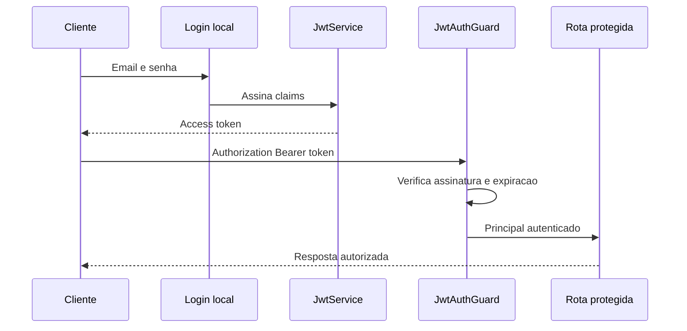

# Encontro 04

## Tema

JWT, guards, autorização por papéis, hash de senha e segurança básica de APIs.

## Objetivos

- Compreender o papel de um token após o login.
- Reconhecer estrutura, assinatura e limitações de um JWT.
- Emitir tokens e proteger rotas com uma estratégia JWT.
- Armazenar senhas por hash com salt e comparação segura.
- Implementar autorização por papéis com metadata e guard.
- Aplicar princípio do menor privilégio e segregação de funções.
- Introduzir gestão de segredos, CORS, rate limiting e proteção contra ataques comuns.
- Preparar a API para a Prática 1 do encontro 5.

## Projeto usado nos exemplos

Os exemplos continuam a aplicação do encontro 3, cuja autenticação local já
está em funcionamento.

```bash
npm install @nestjs/jwt passport-jwt bcrypt
npm install -D @types/passport-jwt @types/bcrypt
```

A configuração utiliza um arquivo `.env` local ignorado pelo Git:

```text
JWT_SECRET=troque-este-valor-no-ambiente-local
JWT_EXPIRES_IN=15m
```

Nunca registre segredos reais em exemplos, commits, prints ou entregas.

## Visão geral

O encontro anterior validou e-mail e senha em uma requisição de login. Isso não
é suficiente para as próximas chamadas. A API precisa reconhecer o usuário sem
receber sua senha em todas as requisições.

Também é necessário corrigir dois problemas:

- senhas não podem permanecer em texto puro;
- usuário autenticado não deve ter acesso automático a todas as operações.

Neste encontro, o login emitirá um JWT, as senhas serão comparadas por hash e
rotas críticas exigirão papéis específicos.

## Pergunta central

Como manter a identidade entre requisições e autorizar operações sem expor
senhas, confiar em dados manipuláveis ou conceder privilégios excessivos?

## Modelo de ameaça inicial

Antes de implementar controles, considere possíveis abusos:

| Ameaça | Exemplo | Controle inicial |
|---|---|---|
| vazamento de senha | banco ou log é exposto | hash com salt; não registrar credenciais |
| força bruta | muitas tentativas de login | rate limit e monitoramento |
| token adulterado | cliente muda o papel no payload | assinatura verificada |
| token roubado | atacante reutiliza token válido | HTTPS, expiração curta e revogação planejada |
| excesso de privilégio | solicitante acessa aprovação | autorização no servidor |
| segredo versionado | chave JWT publicada no Git | variável de ambiente e rotação |

Segurança é composta por camadas. JWT não substitui HTTPS, autorização, gestão
de segredos, validação ou monitoramento.

## Hash de senha

Criptografia reversível não é a solução para armazenar senha. A aplicação não
precisa recuperar a senha original; precisa verificar se a tentativa produz um
resultado compatível.

### Hash, salt e comparação

1. no cadastro, a aplicação recebe a senha;
2. gera um salt e calcula um hash usando algoritmo adequado;
3. armazena somente o resultado;
4. no login, compara a tentativa com o hash armazenado;
5. nunca devolve o hash ao cliente.

```ts
import * as bcrypt from 'bcrypt';

const custo = 12;
const hash = await bcrypt.hash(senhaRecebida, custo);
const corresponde = await bcrypt.compare(tentativa, hash);
```

O fator de custo deve equilibrar resistência e capacidade operacional. Valores
devem ser avaliados no ambiente real, não copiados sem medição.

### Atualização do usuário didático

```ts
type Usuario = {
  id: number;
  nome: string;
  email: string;
  senhaHash: string;
  papel: 'solicitante' | 'gestor' | 'auditor';
  ativo: boolean;
};
```

### Atualização da validação

```ts
async validarUsuario(email: string, senha: string) {
  const usuario = this.usuariosService.buscarPorEmail(email);

  if (!usuario || !usuario.ativo) {
    return null;
  }

  const senhaValida = await bcrypt.compare(senha, usuario.senhaHash);

  if (!senhaValida) {
    return null;
  }

  const { senhaHash: _senhaHash, ...principal } = usuario;
  return principal;
}
```

## O que é JWT?

JWT é um formato compacto de token composto por três partes codificadas:

```text
header.payload.signature
```

- header: algoritmo e tipo do token;
- payload: claims sobre a identidade e o token;
- signature: permite detectar alteração usando uma chave.

### JWT é codificado, não necessariamente criptografado

O payload pode ser lido por quem possui o token. Portanto, não coloque senha,
documentos, informações médicas ou outros dados sensíveis nele.

### Claims úteis

```json
{
  "sub": 1,
  "email": "ana@empresa.com",
  "papel": "gestor",
  "iat": 1786460000,
  "exp": 1786460900
}
```

| Claim | Papel |
|---|---|
| `sub` | identificador estável do sujeito |
| `iat` | instante de emissão |
| `exp` | instante de expiração |
| `iss` | emissor, quando configurado |
| `aud` | público esperado, quando configurado |

## Fluxo completo



## Configurar `JwtModule`

Para o laboratório, a configuração pode ler variáveis de ambiente. Em um
projeto real, use `ConfigModule` com validação de configuração.

```ts
@Module({
  imports: [
    PassportModule,
    JwtModule.register({
      secret: process.env.JWT_SECRET,
      signOptions: {
        expiresIn: process.env.JWT_EXPIRES_IN ?? '15m',
      },
    }),
    UsuariosModule,
  ],
  controllers: [AuthController],
  providers: [AuthService, LocalStrategy, JwtStrategy],
})
export class AuthModule {}
```

Falhe na inicialização se o segredo obrigatório não existir. Usar um valor
padrão fraco em produção transforma erro de configuração em vulnerabilidade.

## Emitir o token

```ts
constructor(
  private readonly usuariosService: UsuariosService,
  private readonly jwtService: JwtService,
) {}

login(usuario: { id: number; email: string; papel: string }) {
  const payload = {
    sub: usuario.id,
    email: usuario.email,
    papel: usuario.papel,
  };

  return {
    accessToken: this.jwtService.sign(payload),
  };
}
```

No controller:

```ts
@UseGuards(LocalAuthGuard)
@Post('login')
login(@Req() request: { user: UsuarioAutenticado }) {
  return this.authService.login(request.user);
}
```

## Validar o token

```ts
import { ExtractJwt, Strategy } from 'passport-jwt';

@Injectable()
export class JwtStrategy extends PassportStrategy(Strategy) {
  constructor() {
    super({
      jwtFromRequest: ExtractJwt.fromAuthHeaderAsBearerToken(),
      ignoreExpiration: false,
      secretOrKey: process.env.JWT_SECRET,
    });
  }

  validate(payload: { sub: number; email: string; papel: string }) {
    return {
      id: payload.sub,
      email: payload.email,
      papel: payload.papel,
    };
  }
}
```

```ts
@Injectable()
export class JwtAuthGuard extends AuthGuard('jwt') {}
```

### Rota autenticada

```ts
@UseGuards(JwtAuthGuard)
@Get('perfil')
perfil(@Req() request: { user: UsuarioAutenticado }) {
  return request.user;
}
```

Chamada:

```bash
curl -i http://localhost:3000/auth/perfil \
  -H 'Authorization: Bearer SEU_TOKEN'
```

## Autorização por papéis — RBAC

RBAC associa permissões a papéis. É simples e útil, mas papéis muito genéricos
podem acumular privilégios. Regras contextuais ainda pertencem ao domínio.

### Decorator de papéis

```ts
export const ROLES_KEY = 'roles';

export const Roles = (...roles: string[]) =>
  SetMetadata(ROLES_KEY, roles);
```

### Guard de papéis

```ts
@Injectable()
export class RolesGuard implements CanActivate {
  constructor(private readonly reflector: Reflector) {}

  canActivate(context: ExecutionContext): boolean {
    const exigidos = this.reflector.getAllAndOverride<string[]>(ROLES_KEY, [
      context.getHandler(),
      context.getClass(),
    ]);

    if (!exigidos?.length) {
      return true;
    }

    const request = context.switchToHttp().getRequest();
    return exigidos.includes(request.user?.papel);
  }
}
```

### Uso em rota

```ts
@UseGuards(JwtAuthGuard, RolesGuard)
@Roles('gestor')
@Patch(':id/aprovar')
aprovar(@Param('id', ParseIntPipe) id: number) {
  return this.service.aprovar(id);
}
```

A ordem importa: primeiro a identidade é autenticada; depois o papel é
verificado.

## Papel não substitui regra de negócio

Um gestor pode ter o papel correto e ainda assim não poder aprovar:

- solicitação de outra unidade;
- solicitação já cancelada;
- compra criada por ele próprio, se houver segregação de funções;
- valor acima de seu limite de alçada.

O guard resolve a autorização ampla. O caso de uso valida regras contextuais.

## Controles complementares

### Segredos

- mantenha `.env` fora do Git;
- publique `.env.example` sem valores reais;
- use segredos diferentes por ambiente;
- planeje rotação;
- não escreva token ou senha em logs.

### CORS

CORS controla quais origens de navegador podem acessar a API. Não é mecanismo
de autenticação e não impede chamadas feitas fora do navegador.

```ts
app.enableCors({
  origin: ['http://localhost:5173'],
  credentials: true,
});
```

### Rate limiting

Limitar tentativas reduz abuso e força bruta. A política deve considerar IP,
identidade, rota, infraestrutura e risco de bloquear usuários legítimos.

### Cabeçalhos e transporte

Em produção, tokens e credenciais devem trafegar por HTTPS. Cabeçalhos de
segurança, política de cookies e proxy reverso precisam ser configurados de
acordo com a forma de implantação.

### Logs de segurança

Logs de segurança incluem evento, instante, resultado e identificadores
apropriados, mas nunca senha, segredo ou token completo.

## Exercício de implementação

A solução que integra os conceitos do encontro contém:

1. senhas em texto puro substituídas por hashes;
2. `validarUsuario` usando comparação segura;
3. login que devolve um access token;
4. `JwtStrategy` e `JwtAuthGuard`;
5. proteção de `GET /auth/perfil`;
6. decorator `@Roles()` e `RolesGuard`;
7. rota de aprovação restrita ao papel `gestor`;
8. verificação dos cenários da matriz abaixo.

## Matriz mínima de testes

| Cenário | Resultado esperado |
|---|---|
| login válido | `201` ou `200` com token, conforme contrato adotado |
| senha inválida | `401` |
| rota protegida sem token | `401` |
| token adulterado | `401` |
| token expirado | `401` |
| papel permitido | operação executada |
| papel não permitido | `403` |
| retorno de usuário | não contém senha nem hash |

## Teste manual do fluxo

```bash
curl -i -X POST http://localhost:3000/auth/login \
  -H 'Content-Type: application/json' \
  -d '{"email":"ana@empresa.com","senha":"123456"}'
```

Copie apenas o token necessário para o teste local:

```bash
curl -i -X PATCH http://localhost:3000/solicitacoes/1/aprovar \
  -H 'Authorization: Bearer SEU_TOKEN'
```

Não inclua tokens válidos nas evidências versionadas.

## Síntese para a Prática 1

O encontro 5 será integralmente reservado à atividade. A base técnica necessária
para sua realização inclui:

- aplicação inicia sem segredo hardcoded;
- login local está funcional;
- hashes substituíram senhas em texto puro;
- JWT é emitido e validado;
- existe uma rota autenticada;
- existe uma rota restrita por papel;
- os principais casos de erro foram testados.

## Erros comuns

### Colocar senha ou dado sensível no JWT

O payload pode ser lido; assinatura não significa confidencialidade.

### Aceitar algoritmo ou segredo inadequado

Validação precisa usar configuração controlada e consistente com o emissor.

### Usar token sem expiração

Quanto maior a validade, maior a janela de abuso após vazamento.

### Confiar no papel enviado pelo cliente

O papel deve vir de uma identidade verificada e de uma fonte confiável.

### Aplicar apenas `RolesGuard`

Sem autenticação anterior, não existe principal confiável para autorizar.

### Registrar o header `Authorization`

Logs podem se tornar uma fonte de vazamento de tokens.

### Tratar JWT como solução completa de sessão

Logout, revogação, renovação, mudanças de papel e comprometimento de conta
exigem decisões adicionais.

## Questões para revisão

1. Por que hash de senha não deve ser reversível?
2. Quais são as três partes de um JWT?
3. Por que o payload do JWT não deve conter informações sensíveis?
4. Qual a diferença entre `JwtAuthGuard` e `RolesGuard`?
5. Quando uma regra de autorização deve permanecer no caso de uso?
6. Que risco existe em versionar `JWT_SECRET`?
7. Por que CORS não substitui autenticação?
8. Como expiração e revogação afetam um token roubado?

## Checklist de aprendizagem

- Sei explicar hash, salt e comparação de senha.
- Sei explicar o que JWT oferece e o que não oferece.
- Consigo emitir e validar um token no NestJS.
- Sei proteger rotas e aplicar autorização por papéis.
- Distingo autorização ampla de regra contextual do domínio.
- Sei identificar segredos que não podem ser versionados.
- Minha API está preparada para a Prática 1.

## Resumo final

A autenticação local foi ampliada para um fluxo entre requisições. Senhas são
verificadas por hash, JWT representa a identidade por tempo limitado e guards
separam autenticação de autorização. O encontro também mostrou que segurança é
um conjunto de controles: segredo, transporte, limitação de tentativas, logs,
validação e regras de negócio continuam necessários.

## Material complementar

- NestJS Authentication: https://docs.nestjs.com/security/authentication
- NestJS Authorization: https://docs.nestjs.com/security/authorization
- NestJS Encryption and Hashing: https://docs.nestjs.com/security/encryption-and-hashing
- OWASP Password Storage Cheat Sheet: https://cheatsheetseries.owasp.org/cheatsheets/Password_Storage_Cheat_Sheet.html
- OWASP JSON Web Token Cheat Sheet: https://cheatsheetseries.owasp.org/cheatsheets/JSON_Web_Token_for_Java_Cheat_Sheet.html
- OWASP API Security: https://owasp.org/API-Security/
