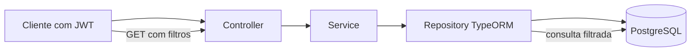

# Encontro 07 — Atividade prática de persistência

## Tema

Modelagem relacional e consultas com PostgreSQL, TypeORM e NestJS.

## Objetivos

- Fixar o conteúdo desenvolvido no encontro 06.
- Alterar o modelo sem retornar ao armazenamento em memória.
- Aplicar validação no contrato HTTP e no modelo persistente.
- Usar o repositório TypeORM para inserir, filtrar e consultar registros.
- Preservar autenticação e autorização anteriores.
- Verificar a persistência depois do reinício da API.
- Explicar as responsabilidades de DTO, entidade, repositório e service.

## Organização sugerida (90 minutos)

1. Preparação e teste do ponto de partida: 10 min
2. Modelagem e alteração da entidade: 20 min
3. Implementação dos DTOs, service e controller: 35 min
4. Execução dos testes: 15 min
5. Evidências e retrospectiva: 10 min

## Modalidade e ponto de partida

A atividade é individual e utiliza o projeto do encontro 06. Antes de
começar, confirme que:

- `docker compose up --build` inicia API e PostgreSQL;
- o login devolve um JWT;
- `POST /solicitacoes` grava no banco;
- `GET /solicitacoes` apresenta os registros;
- a aprovação continua restrita ao papel `gestor`.

Nesta atividade, `synchronize: true` permanece apenas no ambiente didático.
Migrations e evolução segura do schema serão estudadas no encontro 08.

## Situação-problema

A equipe de compras passou a receber muitas solicitações. Apenas título e
status não bastam para organizar o trabalho. Cada solicitação deve informar o
centro de custo e sua prioridade. A listagem também deve aceitar filtros sem
carregar todos os registros para um array na aplicação.

## Resultado esperado



## Requisitos obrigatórios

### 1. Ampliar o modelo persistente

Acrescente à entidade `Solicitacao`:

| Campo | Tipo TypeScript | Mapeamento | Regra |
|---|---|---|---|
| `centroCusto` | `string` | `varchar(30)` | obrigatório |
| `prioridade` | `'normal' \| 'urgente'` | `varchar(10)` | padrão `normal` |

Use os nomes `centro_custo` e `prioridade` no PostgreSQL. Preserve id, título,
status, versão e datas. Se o exercício do encontro 06 já acrescentou
`centroCusto`, revise o mapeamento e implemente somente o que falta.

### 2. Validar a criação

Atualize `CriarSolicitacaoDto` para aceitar:

```json
{
  "titulo": "Aquisição de teclado ergonômico",
  "centroCusto": "TI-DEV",
  "prioridade": "urgente"
}
```

Regras:

- `titulo`: texto entre 5 e 150 caracteres;
- `centroCusto`: texto entre 2 e 30 caracteres;
- `prioridade`: somente `normal` ou `urgente`;
- campos adicionais devem ser rejeitados pelo `ValidationPipe` global.

O service deve copiar somente os campos validados para a entidade e salvá-la
pelo repositório. Não use o corpo completo nem restaure o array em memória.

### 3. Filtrar no banco

Adapte a rota:

```http
GET /solicitacoes?status=pendente&centroCusto=TI-DEV&prioridade=urgente
```

Todos os filtros são opcionais e combináveis. Crie
`FiltrarSolicitacoesDto` com:

- `status`: `pendente` ou `aprovada`;
- `centroCusto`: texto com no máximo 30 caracteres;
- `prioridade`: `normal` ou `urgente`.

Receba o DTO com `@Query()`. No service, entregue a condição a
`repository.find`; não use `Array.filter` depois da consulta.

```ts
return this.repository.find({
  where: {
    ...(filtros.status && { status: filtros.status }),
    ...(filtros.centroCusto && { centroCusto: filtros.centroCusto }),
    ...(filtros.prioridade && { prioridade: filtros.prioridade }),
  },
  order: { id: 'ASC' },
});
```

O trecho orienta a consulta; ajuste tipos e imports ao seu projeto.

### 4. Preservar o comportamento existente

- criação, listagem e consulta por id continuam exigindo JWT;
- aprovação continua exclusiva do papel `gestor`;
- nenhuma resposta apresenta senha, hash, segredo ou token;
- id inexistente continua produzindo `404 Not Found`;
- entrada inválida produz `400 Bad Request` sem gravar dados.

### 5. Confirmar persistência

Depois de criar os registros, reinicie somente a API:

```bash
docker compose stop api
docker compose start api
```

Os dados e os novos campos devem continuar disponíveis.

## Roteiro de implementação

1. Teste a aplicação antes das alterações.
2. Modifique `solicitacao.entity.ts`.
3. Atualize `CriarSolicitacaoDto`.
4. Crie `FiltrarSolicitacoesDto`.
5. Adapte `criar` e `listar` no service.
6. Receba `@Query()` no controller.
7. Reinicie o ambiente e observe o schema.
8. Cadastre os registros de teste.
9. Execute a matriz e inspecione o banco.

## Dados para os testes

| Título | Centro de custo | Prioridade |
|---|---|---|
| Aquisição de monitor | `TI-DEV` | `normal` |
| Substituição de servidor | `TI-INFRA` | `urgente` |
| Licença de ferramenta de testes | `TI-DEV` | `urgente` |

Crie os registros pela API, pois isso também verifica DTO, controller,
service e repositório.

## Matriz de testes

| Caso | Requisição | Resultado esperado |
|---:|---|---|
| 1 | criação válida com JWT | `201`, campos persistidos |
| 2 | criação sem `centroCusto` | `400`, nenhuma inserção |
| 3 | criação com prioridade `alta` | `400`, nenhuma inserção |
| 4 | criação com campo desconhecido | `400`, nenhuma inserção |
| 5 | listagem sem filtros | `200`, registros cadastrados |
| 6 | filtro `centroCusto=TI-DEV` | `200`, dois registros novos |
| 7 | filtro `prioridade=urgente` | `200`, dois registros novos |
| 8 | filtros `TI-DEV` e `urgente` | `200`, um registro novo |
| 9 | listagem sem token | `401` |
| 10 | consulta depois de reiniciar a API | dados preservados |

Registros anteriores no volume podem aumentar os totais. Nesse caso, valide os
três registros pelos dados apresentados acima.

## Inspecionar o banco

```bash
docker compose exec db psql -U app -d solicitacoes -c "\d solicitacoes"
docker compose exec db psql -U app -d solicitacoes -c "SELECT id, titulo, centro_custo, prioridade, status FROM solicitacoes ORDER BY id;"
```

Compare o SQL com a resposta da API. SQL é evidência da persistência, mas os
clientes do sistema devem passar pelas regras da API.

## Evidência esperada

Produza um commit com a mensagem sugerida:

```text
feat: classificar e filtrar solicitacoes persistidas
```

Registre uma criação válida, uma entrada rejeitada, dois filtros combinados,
a consulta depois do reinício e a saída do `psql`. Não registre tokens ou
credenciais.

## Questões para retrospectiva

1. Por que validar `prioridade` se o TypeScript já declara seu tipo?
2. Qual é a diferença entre `repository.create` e `repository.save`?
3. Por que executar os filtros no banco?
4. O que seria perdido se a aplicação ainda utilizasse um array?
5. Por que o volume não substitui um backup?
6. Qual limitação permanece com `synchronize` habilitado?

## Critérios de conclusão

| Critério | Evidência |
|---|---|
| modelo ampliado | novas colunas no PostgreSQL |
| contrato validado | entradas inválidas retornam `400` |
| uso correto do ORM | criação e filtros usam o repositório |
| segurança preservada | rotas continuam protegidas |
| persistência confirmada | registros sobrevivem ao reinício |
| compreensão | respostas da retrospectiva coerentes |

## Erros comuns

- filtrar com `Array.filter` em vez de consultar o banco;
- entregar o corpo inteiro a `save`, permitindo campos indevidos;
- remover guards ao alterar o controller;
- esquecer a validação dos filtros opcionais;
- executar `docker compose down --volumes` ao testar persistência.

## Checklist do estudante

- Ampliei a entidade sem recriar o projeto.
- Atualizei os DTOs e rejeitei valores inválidos.
- Salvei somente campos permitidos.
- Executei filtros pelo repositório.
- Preservei autenticação e autorização.
- Testei todos os cenários da matriz.
- Confirmei os registros com `psql`.
- Reiniciei a API e verifiquei a persistência.
- Registrei evidências sem tokens ou segredos.

## Resumo final

A atividade ampliou o exemplo do encontro 06 com classificação e consultas
filtradas. DTO, entidade, service e repositório mantiveram responsabilidades
diferentes, enquanto PostgreSQL preservou o estado fora do processo da API. No
encontro 08, o schema passará a evoluir por migrations, com transações,
concorrência e auditoria.
