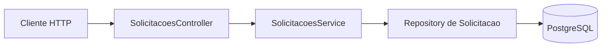

# Encontro 07

## Tema

PostgreSQL, modelagem relacional e persistência com TypeORM no NestJS.

## Objetivos

- Continuar a API de solicitações dos encontros anteriores.
- Executar PostgreSQL e API com Docker Compose.
- Traduzir um modelo de domínio simples para tabela, colunas e restrições.
- Configurar TypeORM por variáveis de ambiente.
- Substituir o array em memória por um repositório persistente.
- Diferenciar entidade, DTO, repositório e service.
- Confirmar que os dados permanecem depois do reinício da API.
- Preparar migrations, transações e auditoria do encontro 09.

## Ponto de partida

Use o projeto desenvolvido nos encontros 03 a 05. Ele deve possuir
autenticação local, JWT, autorização por papéis, o módulo `solicitacoes` e os
arquivos de Docker. Preserve as rotas e regras de segurança já implementadas.

Neste encontro, somente as solicitações deixarão de usar o array em memória.
Os usuários podem continuar no `UsuariosService`, mantendo o foco da mudança.

## Resultado esperado



Ao final, criar e consultar uma solicitação deve produzir operações no
PostgreSQL, e o registro deve continuar disponível após reiniciar a API.

## Por que trocar o array?

O array ajudou a estudar HTTP e segurança, mas não atende a um processo
corporativo porque desaparece com o processo, não oferece integridade,
transações ou coordenação entre escritas concorrentes. Um ORM reduz código
repetitivo, mas não elimina a necessidade de compreender SQL e modelagem.

## Modelo relacional inicial

| Coluna | Tipo | Restrição | Motivo |
|---|---|---|---|
| `id` | inteiro | chave primária gerada | identifica o registro |
| `titulo` | varchar(150) | obrigatória | descreve a solicitação |
| `status` | varchar(20) | obrigatória | representa o estado atual |
| `versao` | inteiro | obrigatória | apoiará o controle de concorrência |
| `criada_em` | timestamptz | obrigatória | registra a criação |
| `atualizada_em` | timestamptz | obrigatória | registra a última alteração |

O identificador é uma chave técnica. O título não é uma boa chave: pode
mudar e duas solicitações podem possuir o mesmo texto.

## Passo 1 — Instalar as dependências

```bash
docker compose run --rm api npm install @nestjs/typeorm typeorm pg @nestjs/config
```

- `@nestjs/typeorm` integra o ORM aos módulos do NestJS;
- `typeorm` realiza o mapeamento e as consultas;
- `pg` é o driver do PostgreSQL;
- `@nestjs/config` disponibiliza configurações da aplicação.

## Passo 2 — Acrescentar PostgreSQL ao Compose

Atualize `compose.yaml`, preservando configurações adicionais da sua API:

```yaml
services:
  api:
    build: .
    ports:
      - "3000:3000"
    volumes:
      - .:/app
      - node_modules:/app/node_modules
    env_file:
      - .env
    depends_on:
      db:
        condition: service_healthy
    command: npm run start:dev

  db:
    image: postgres:17-alpine
    ports:
      - "5432:5432"
    environment:
      POSTGRES_DB: ${DB_NAME}
      POSTGRES_USER: ${DB_USER}
      POSTGRES_PASSWORD: ${DB_PASSWORD}
    healthcheck:
      test: ["CMD-SHELL", "pg_isready -U $${POSTGRES_USER} -d $${POSTGRES_DB}"]
      interval: 5s
      timeout: 5s
      retries: 10
    volumes:
      - postgres_data:/var/lib/postgresql/data

volumes:
  node_modules:
  postgres_data:
```

O volume separa a vida dos dados da vida do contêiner. O `healthcheck` evita
que a API tente conectar enquanto o banco ainda está inicializando. A senha é
didática e exclusiva do ambiente local; não seria adequada para produção.

## Passo 3 — Configurar o ambiente

Acrescente ao `.env` local e use chaves equivalentes no `.env.example`:

```dotenv
DB_HOST=db
DB_PORT=5432
DB_NAME=solicitacoes
DB_USER=app
DB_PASSWORD=app-local
```

O `.env` deve continuar ignorado pelo Git. Dentro da rede do Compose,
`DB_HOST=db` aponta para o serviço do PostgreSQL. `localhost` apontaria para o
próprio contêiner da API.

## Passo 4 — Criar a entidade

Crie `src/solicitacoes/solicitacao.entity.ts`:

```ts
import {
  Column,
  CreateDateColumn,
  Entity,
  PrimaryGeneratedColumn,
  UpdateDateColumn,
  VersionColumn,
} from 'typeorm';

export type StatusSolicitacao = 'pendente' | 'aprovada';

@Entity({ name: 'solicitacoes' })
export class Solicitacao {
  @PrimaryGeneratedColumn()
  id: number;

  @Column({ type: 'varchar', length: 150 })
  titulo: string;

  @Column({ type: 'varchar', length: 20, default: 'pendente' })
  status: StatusSolicitacao;

  @VersionColumn({ name: 'versao' })
  versao: number;

  @CreateDateColumn({ name: 'criada_em', type: 'timestamptz' })
  criadaEm: Date;

  @UpdateDateColumn({ name: 'atualizada_em', type: 'timestamptz' })
  atualizadaEm: Date;
}
```

A entidade mapeia objetos e registros; ela não deve conter regras HTTP.
`VersionColumn` será usada no encontro 09 para detectar estado antigo.

## Passo 5 — Configurar TypeORM

Atualize `src/app.module.ts`, preservando outros módulos:

```ts
import { Module } from '@nestjs/common';
import { ConfigModule, ConfigService } from '@nestjs/config';
import { TypeOrmModule } from '@nestjs/typeorm';
import { AuthModule } from './auth/auth.module';
import { SolicitacoesModule } from './solicitacoes/solicitacoes.module';

@Module({
  imports: [
    ConfigModule.forRoot({ isGlobal: true }),
    TypeOrmModule.forRootAsync({
      inject: [ConfigService],
      useFactory: (config: ConfigService) => ({
        type: 'postgres',
        host: config.getOrThrow<string>('DB_HOST'),
        port: Number(config.get('DB_PORT') ?? 5432),
        database: config.getOrThrow<string>('DB_NAME'),
        username: config.getOrThrow<string>('DB_USER'),
        password: config.getOrThrow<string>('DB_PASSWORD'),
        autoLoadEntities: true,
        synchronize: true,
      }),
    }),
    AuthModule,
    SolicitacoesModule,
  ],
})
export class AppModule {}
```

`synchronize: true` é uma simplificação temporária para observar o
mapeamento. Não oferece histórico revisável e não deve ser habilitado em
produção. No encontro 09, ele será substituído por migrations.

## Passo 6 — Registrar o repositório

Substitua `src/solicitacoes/solicitacoes.module.ts` por:

```ts
import { Module } from '@nestjs/common';
import { TypeOrmModule } from '@nestjs/typeorm';
import { AuthModule } from '../auth/auth.module';
import { Solicitacao } from './solicitacao.entity';
import { SolicitacoesController } from './solicitacoes.controller';
import { SolicitacoesService } from './solicitacoes.service';

@Module({
  imports: [AuthModule, TypeOrmModule.forFeature([Solicitacao])],
  controllers: [SolicitacoesController],
  providers: [SolicitacoesService],
})
export class SolicitacoesModule {}
```

`forFeature` torna `Repository<Solicitacao>` injetável neste módulo.

## Passo 7 — Criar o DTO

Crie `src/solicitacoes/dto/criar-solicitacao.dto.ts`:

```ts
import { IsString, MaxLength, MinLength } from 'class-validator';

export class CriarSolicitacaoDto {
  @IsString()
  @MinLength(5)
  @MaxLength(150)
  titulo: string;
}
```

O DTO protege a entrada HTTP; as restrições do banco protegem o estado
persistido. As duas camadas são complementares.

## Passo 8 — Substituir o array pelo repositório

Substitua `src/solicitacoes/solicitacoes.service.ts` por:

```ts
import { Injectable, NotFoundException } from '@nestjs/common';
import { InjectRepository } from '@nestjs/typeorm';
import { Repository } from 'typeorm';
import { CriarSolicitacaoDto } from './dto/criar-solicitacao.dto';
import { Solicitacao } from './solicitacao.entity';

@Injectable()
export class SolicitacoesService {
  constructor(
    @InjectRepository(Solicitacao)
    private readonly repository: Repository<Solicitacao>,
  ) {}

  listar() {
    return this.repository.find({ order: { id: 'ASC' } });
  }

  async buscarPorId(id: number) {
    const solicitacao = await this.repository.findOneBy({ id });
    if (!solicitacao) {
      throw new NotFoundException('Solicitação não encontrada');
    }
    return solicitacao;
  }

  criar(dto: CriarSolicitacaoDto) {
    const solicitacao = this.repository.create({
      titulo: dto.titulo,
      status: 'pendente',
    });
    return this.repository.save(solicitacao);
  }

  async aprovar(id: number) {
    const solicitacao = await this.buscarPorId(id);
    solicitacao.status = 'aprovada';
    return this.repository.save(solicitacao);
  }
}
```

`create` constrói a entidade; `save` realiza a escrita. O acesso ao banco é
assíncrono, por isso consultas e alterações passam a devolver promises.

## Passo 9 — Atualizar o controller

Mantenha os guards e papéis anteriores e acrescente criação e listagem:

```ts
@UseGuards(JwtAuthGuard)
@Post()
criar(@Body() dto: CriarSolicitacaoDto) {
  return this.service.criar(dto);
}

@UseGuards(JwtAuthGuard)
@Get()
listar() {
  return this.service.listar();
}

@UseGuards(JwtAuthGuard)
@Get(':id')
buscarPorId(@Param('id', ParseIntPipe) id: number) {
  return this.service.buscarPorId(id);
}

@UseGuards(JwtAuthGuard, RolesGuard)
@Roles('gestor')
@Patch(':id/aprovar')
aprovar(@Param('id', ParseIntPipe) id: number) {
  return this.service.aprovar(id);
}
```

Importe `Body`, `Get`, `Post`, `CriarSolicitacaoDto` e os demais símbolos que
ainda não existirem. Se a Prática 1 acrescentou a rota `relatorio`, preserve-a
e adapte seu cálculo ao repositório. Rotas literais devem aparecer antes de
`@Get(':id')` para não serem interpretadas como id.

## Passo 10 — Executar e testar

```bash
docker compose up --build
```

Faça login e envie o token como **Bearer**.

### Criar

```http
POST /solicitacoes
Authorization: Bearer TOKEN
Content-Type: application/json

{
  "titulo": "Aquisição de monitor para desenvolvimento"
}
```

Resultado esperado: `201 Created`, com id, status `pendente`, versão e datas.

### Consultar e validar

- `GET /solicitacoes`: `200 OK` com a lista;
- `GET /solicitacoes/1`: `200 OK` quando o id existir;
- `GET /solicitacoes/999999`: `404 Not Found`;
- criação com título curto: `400 Bad Request`, sem inserção.

### Confirmar persistência

```bash
docker compose stop api
docker compose start api
```

Repita a listagem. O registro deve permanecer no PostgreSQL. Inspecione-o:

```bash
docker compose exec db psql -U app -d solicitacoes -c "SELECT id, titulo, status, versao FROM solicitacoes;"
```

## Matriz mínima de testes

| Cenário | Resultado esperado |
|---|---|
| criação válida com JWT | `201`, registro persistido |
| criação sem JWT | `401` |
| título inválido | `400`, nenhuma inserção |
| busca de id existente | `200` |
| busca de id inexistente | `404` |
| reinício somente da API | dados preservados |

## Exercício de fixação

Acrescente o campo obrigatório `centroCusto`, limitado a 30 caracteres, à
entidade e ao DTO. Cadastre duas solicitações de centros diferentes e confirme
a coluna com `psql`. Registre em três linhas quais restrições ficaram no DTO e
quais chegaram ao banco.

> Como `synchronize` ainda está ativo, a mudança é automática e adequada apenas
> ao laboratório. Não aplique esse procedimento a um banco de produção.

## Conceitos consolidados

### Entidade não é DTO

O DTO valida a entrada da API. A entidade mapeia o estado persistido. Expor a
entidade em todos os contratos pode revelar campos internos e aumentar o
acoplamento.

### Repositório não substitui service

O repositório oferece operações de persistência. O service continua coordenando
regras e transições de estado.

### Volume não é backup

O volume preserva dados entre contêineres, mas não oferece sozinho política de
cópia, retenção, restauração ou recuperação de desastre.

## Erros comuns

- usar `localhost` como host do banco entre contêineres;
- esquecer `TypeOrmModule.forFeature`;
- confiar somente na validação do DTO;
- confundir `repository.create` com uma inserção;
- manter `synchronize: true` em produção.

## Questões para revisão

1. Por que o array não atende a um processo corporativo?
2. Qual é a responsabilidade de entidade, DTO, repositório e service?
3. Por que `DB_HOST` recebe `db` no Compose?
4. O que o volume `postgres_data` preserva?
5. Por que `synchronize` será desativado no próximo encontro?

## Checklist de aprendizagem

- Executei API e PostgreSQL pelo Docker Compose.
- Modelei uma solicitação como entidade relacional.
- Configurei o banco sem colocar credenciais no código.
- Injetei e utilizei um repositório TypeORM.
- Substituí o array por dados persistentes.
- Testei validação, consulta e persistência após reinício.
- Reconheço por que `synchronize` não substitui migrations.

## Resumo final

A API passou a armazenar solicitações no PostgreSQL. Docker Compose tornou
explícitas as dependências e o volume; TypeORM mapeou a entidade e forneceu o
repositório; DTO e schema passaram a proteger camadas diferentes. No encontro
07, o schema será versionado e a aprovação combinará mudança de estado e
auditoria em uma transação.

## Material complementar

- NestJS Database: https://docs.nestjs.com/techniques/database
- NestJS Configuration: https://docs.nestjs.com/techniques/configuration
- TypeORM Entities: https://typeorm.io/docs/entity/entities
- TypeORM Repository APIs: https://typeorm.io/docs/working-with-entity-manager/working-with-repository
- PostgreSQL Constraints: https://www.postgresql.org/docs/current/ddl-constraints.html
- Docker Compose: https://docs.docker.com/compose/
