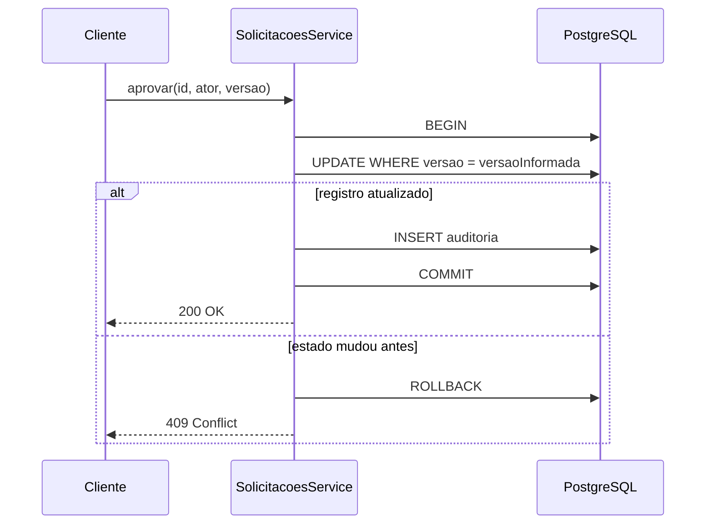

# Encontro 09

## Correção da atividade do encontro 08

Antes de iniciar o conteúdo novo, compare sua implementação com a solução a
seguir. Não é necessário que o código esteja idêntico, mas o resultado deve
manter as responsabilidades separadas e executar os filtros no PostgreSQL.

### Entidade atualizada

Em `src/solicitacoes/solicitacao.entity.ts`, acrescente os novos campos e
preserve os que já existiam:

```ts
import {
  Column,
  CreateDateColumn,
  Entity,
  PrimaryGeneratedColumn,
  UpdateDateColumn,
  VersionColumn,
} from 'typeorm';

export type StatusSolicitacao = 'pendente' | 'aprovada';
export type PrioridadeSolicitacao = 'normal' | 'urgente';

@Entity({ name: 'solicitacoes' })
export class Solicitacao {
  @PrimaryGeneratedColumn()
  id: number;

  @Column({ type: 'varchar', length: 150 })
  titulo: string;

  @Column({ name: 'centro_custo', type: 'varchar', length: 30 })
  centroCusto: string;

  @Column({ type: 'varchar', length: 10, default: 'normal' })
  prioridade: PrioridadeSolicitacao;

  @Column({ type: 'varchar', length: 20, default: 'pendente' })
  status: StatusSolicitacao;

  @VersionColumn({ name: 'versao' })
  versao: number;

  @CreateDateColumn({ name: 'criada_em', type: 'timestamptz' })
  criadaEm: Date;

  @UpdateDateColumn({ name: 'atualizada_em', type: 'timestamptz' })
  atualizadaEm: Date;
}
```

O nome usado no JSON pode seguir o padrão do TypeScript (`centroCusto`),
enquanto `name: 'centro_custo'` mantém o padrão escolhido para o banco.

### DTO de criação

Atualize `src/solicitacoes/dto/criar-solicitacao.dto.ts`:

```ts
import { IsIn, IsString, MaxLength, MinLength } from 'class-validator';
import type { PrioridadeSolicitacao } from '../solicitacao.entity';

export class CriarSolicitacaoDto {
  @IsString()
  @MinLength(5)
  @MaxLength(150)
  titulo: string;

  @IsString()
  @MinLength(2)
  @MaxLength(30)
  centroCusto: string;

  @IsIn(['normal', 'urgente'])
  prioridade: PrioridadeSolicitacao;
}
```

O tipo TypeScript ajuda durante o desenvolvimento, mas `@IsIn` valida o valor
recebido quando a aplicação está em execução.

### DTO dos filtros

Crie `src/solicitacoes/dto/filtrar-solicitacoes.dto.ts`:

```ts
import { IsIn, IsOptional, IsString, MaxLength } from 'class-validator';
import type {
  PrioridadeSolicitacao,
  StatusSolicitacao,
} from '../solicitacao.entity';

export class FiltrarSolicitacoesDto {
  @IsOptional()
  @IsIn(['pendente', 'aprovada'])
  status?: StatusSolicitacao;

  @IsOptional()
  @IsString()
  @MaxLength(30)
  centroCusto?: string;

  @IsOptional()
  @IsIn(['normal', 'urgente'])
  prioridade?: PrioridadeSolicitacao;
}
```

`@IsOptional` faz com que cada filtro possa ser omitido, mas, quando enviado,
seu valor ainda precisa ser válido.

### Criação e listagem no service

No `SolicitacoesService`, importe `FindOptionsWhere` e os DTOs:

```ts
import { FindOptionsWhere, Repository } from 'typeorm';
import { CriarSolicitacaoDto } from './dto/criar-solicitacao.dto';
import { FiltrarSolicitacoesDto } from './dto/filtrar-solicitacoes.dto';
import { Solicitacao } from './solicitacao.entity';
```

Adapte os métodos `criar` e `listar`:

```ts
criar(dto: CriarSolicitacaoDto) {
  const solicitacao = this.repository.create({
    titulo: dto.titulo,
    centroCusto: dto.centroCusto,
    prioridade: dto.prioridade,
    status: 'pendente',
  });

  return this.repository.save(solicitacao);
}

listar(filtros: FiltrarSolicitacoesDto) {
  const where: FindOptionsWhere<Solicitacao> = {};

  if (filtros.status) {
    where.status = filtros.status;
  }

  if (filtros.centroCusto) {
    where.centroCusto = filtros.centroCusto;
  }

  if (filtros.prioridade) {
    where.prioridade = filtros.prioridade;
  }

  return this.repository.find({
    where,
    order: { id: 'ASC' },
  });
}
```

Os campos são copiados explicitamente no cadastro. Assim, o cliente não
consegue definir livremente `id`, `status`, `versao` ou datas. Na listagem, o
objeto `where` é convertido pelo TypeORM em uma consulta filtrada no banco.

### Controller

Receba os filtros da query string e preserve o guard JWT:

```ts
import { Body, Get, Post, Query, UseGuards } from '@nestjs/common';
import { CriarSolicitacaoDto } from './dto/criar-solicitacao.dto';
import { FiltrarSolicitacoesDto } from './dto/filtrar-solicitacoes.dto';

@UseGuards(JwtAuthGuard)
@Post()
criar(@Body() dto: CriarSolicitacaoDto) {
  return this.service.criar(dto);
}

@UseGuards(JwtAuthGuard)
@Get()
listar(@Query() filtros: FiltrarSolicitacoesDto) {
  return this.service.listar(filtros);
}
```

Esses imports devem ser combinados com os que o controller já utiliza. Não
remova a consulta por id, a rota de relatório ou a aprovação protegida por
papel.

### Conferência rápida

Depois de iniciar a aplicação, confirme:

1. cadastro com `centroCusto` e prioridade válida retorna `201`;
2. prioridade `alta` retorna `400`;
3. `GET /solicitacoes?centroCusto=TI-DEV&prioridade=urgente` retorna somente os
   registros correspondentes;
4. listagem sem token retorna `401`;
5. os registros continuam disponíveis depois de reiniciar apenas a API.

Se esses resultados forem obtidos, a atividade está corrigida e o projeto está
pronto para substituir `synchronize` por migrations.

## Tema

Migrations, transações, concorrência e trilha de auditoria com TypeORM.

## Objetivos

- Evoluir o schema de forma versionada e repetível.
- Substituir `synchronize` por migrations.
- Delimitar uma transação de negócio.
- Garantir atomicidade entre aprovação e auditoria.
- Detectar atualizações concorrentes com controle otimista.
- Diferenciar log técnico de trilha de auditoria.
- Testar sucesso, conflito, negação e rollback.
- Preparar a Prática 2 do encontro 12.

## Ponto de partida

Continue no projeto ampliado no encontro 08. Ele deve executar NestJS e
PostgreSQL pelo Docker Compose e persistir `Solicitacao` por meio do TypeORM.
Antes de alterar o projeto, crie e consulte um registro para confirmar o estado
inicial.

## Situação-problema

A empresa precisa responder qual é o estado de uma solicitação, quem tomou a
decisão e quando. Aprovar passa a exigir duas escritas:

1. mudar a solicitação de `pendente` para `aprovada`;
2. inserir uma evidência na trilha de auditoria.

Confirmar apenas uma delas deixa o sistema inconsistente. Duas pessoas também
podem tentar decidir sobre o mesmo registro quase simultaneamente.

## Resultado esperado



## Conceitos fundamentais

### Migration

É uma alteração versionada do schema. A equipe pode revisar seu SQL,
reproduzir as mudanças na mesma ordem e identificar a versão instalada.

### Transação

Agrupa operações que devem ser confirmadas ou desfeitas como uma unidade.
Aprovação sem auditoria e auditoria sem aprovação são estados inválidos.

### Concorrência otimista

Aceita que conflitos não sejam a regra, mas verifica a versão no momento da
escrita. Se outra operação alterou o registro, a API rejeita a decisão baseada
em estado antigo com `409 Conflict`.

### Auditoria

Registra evidência de negócio: ator, ação, recurso e instante. Logs técnicos
ajudam no diagnóstico; auditoria responde quem realizou uma ação relevante.
Nenhum deles deve armazenar senha, token ou segredo.

## Passo 1 — Configurar a CLI do TypeORM

```bash
docker compose run --rm api npm install dotenv
```

Crie `src/database/data-source.ts`:

```ts
import 'dotenv/config';
import { DataSource } from 'typeorm';
import { Solicitacao } from '../solicitacoes/solicitacao.entity';

export default new DataSource({
  type: 'postgres',
  host: process.env.DB_HOST,
  port: Number(process.env.DB_PORT ?? 5432),
  database: process.env.DB_NAME,
  username: process.env.DB_USER,
  password: process.env.DB_PASSWORD,
  entities: [Solicitacao],
  migrations: ['src/database/migrations/*{.ts,.js}'],
  synchronize: false,
});
```

O arquivo atende à CLI, fora do ciclo de injeção do NestJS. Acrescente estes
scripts ao objeto `scripts` de `package.json`, sem remover os existentes:

```json
{
  "typeorm": "typeorm-ts-node-commonjs -d src/database/data-source.ts",
  "migration:generate": "npm run typeorm -- migration:generate",
  "migration:run": "npm run typeorm -- migration:run",
  "migration:revert": "npm run typeorm -- migration:revert"
}
```

## Passo 2 — Criar a migration inicial

Os encontros 07 e 08 criaram tabelas com `synchronize`. Para gerar uma linha de base
limpa neste laboratório:

```bash
docker compose down --volumes
docker compose up -d db
docker compose run --rm api npm run migration:generate -- src/database/migrations/Inicial
docker compose run --rm api npm run migration:run
```

> `docker compose down --volumes` apaga os dados locais deste projeto. Não use
> o comando em um ambiente com dados que precisem ser preservados. Sistemas
> existentes exigem plano de linha de base, backup e recuperação.

Abra a migration gerada e identifique `up` e `down`. O primeiro aplica a
mudança; o segundo deve revertê-la quando isso for seguro.

## Passo 3 — Desativar a sincronização automática

No `TypeOrmModule.forRootAsync` de `src/app.module.ts`, use:

```ts
autoLoadEntities: true,
synchronize: false,
migrations: [__dirname + '/database/migrations/*{.ts,.js}'],
migrationsRun: true,
```

No laboratório, migrations pendentes serão aplicadas ao iniciar a API. Em
produção, esse passo pode ficar no pipeline, com permissões e rollback
controlados.

## Passo 4 — Modelar a auditoria

Crie `src/auditoria/auditoria.entity.ts`:

```ts
import {
  Column,
  CreateDateColumn,
  Entity,
  PrimaryGeneratedColumn,
} from 'typeorm';

@Entity({ name: 'auditorias' })
export class Auditoria {
  @PrimaryGeneratedColumn()
  id: number;

  @Column({ name: 'ator_id', type: 'int' })
  atorId: number;

  @Column({ type: 'varchar', length: 50 })
  acao: string;

  @Column({ name: 'recurso_tipo', type: 'varchar', length: 50 })
  recursoTipo: string;

  @Column({ name: 'recurso_id', type: 'int' })
  recursoId: number;

  @Column({ type: 'jsonb', nullable: true })
  detalhes: Record<string, unknown> | null;

  @CreateDateColumn({ name: 'criada_em', type: 'timestamptz' })
  criadaEm: Date;
}
```

O exemplo não cria chave estrangeira em `atorId` porque os usuários ainda estão
em memória. Quando eles forem persistidos, a relação e a retenção precisarão
ser modeladas conscientemente.

Gere e aplique a mudança:

Antes de gerar, acrescente a nova entidade ao `data-source.ts` usado pela CLI:

```ts
import { Auditoria } from '../auditoria/auditoria.entity';

// Na configuração do DataSource:
entities: [Solicitacao, Auditoria],
```

```bash
docker compose run --rm api npm run migration:generate -- src/database/migrations/AdicionarAuditoria
docker compose run --rm api npm run migration:run
```

Confirme o histórico:

```bash
docker compose exec db psql -U app -d solicitacoes -c "SELECT * FROM migrations ORDER BY id;"
```

## Passo 5 — Receber versão e identificar o ator

Crie `src/solicitacoes/dto/aprovar-solicitacao.dto.ts`:

```ts
import { IsInt, Min } from 'class-validator';

export class AprovarSolicitacaoDto {
  @IsInt()
  @Min(1)
  versao: number;
}
```

Atualize a rota de aprovação:

```ts
type RequisicaoAutenticada = {
  user: { id: number; papel: string };
};

@UseGuards(JwtAuthGuard, RolesGuard)
@Roles('gestor')
@Patch(':id/aprovar')
aprovar(
  @Param('id', ParseIntPipe) id: number,
  @Body() dto: AprovarSolicitacaoDto,
  @Req() request: RequisicaoAutenticada,
) {
  return this.service.aprovar(id, dto.versao, request.user.id);
}
```

Acrescente `Req` e o DTO aos imports. A versão vem do estado consultado pelo
cliente; o ator vem do JWT validado, nunca do corpo da requisição.

## Passo 6 — Tornar aprovação e auditoria atômicas

No `SolicitacoesService`, injete `DataSource` além do repositório e substitua o
método `aprovar`:

```ts
import {
  ConflictException,
  Injectable,
  NotFoundException,
} from '@nestjs/common';
import { DataSource } from 'typeorm';
import { Auditoria } from '../auditoria/auditoria.entity';

constructor(
  @InjectRepository(Solicitacao)
  private readonly repository: Repository<Solicitacao>,
  private readonly dataSource: DataSource,
) {}

async aprovar(id: number, versaoEsperada: number, atorId: number) {
  return this.dataSource.transaction(async (manager) => {
    const solicitacao = await manager.findOneBy(Solicitacao, { id });

    if (!solicitacao) {
      throw new NotFoundException('Solicitação não encontrada');
    }
    if (solicitacao.status !== 'pendente') {
      throw new ConflictException('Solicitação não está pendente');
    }

    const resultado = await manager
      .createQueryBuilder()
      .update(Solicitacao)
      .set({ status: 'aprovada', versao: () => 'versao + 1' })
      .where('id = :id', { id })
      .andWhere('versao = :versao', { versao: versaoEsperada })
      .andWhere('status = :status', { status: 'pendente' })
      .execute();

    if (resultado.affected !== 1) {
      throw new ConflictException(
        'A solicitação foi alterada; consulte novamente',
      );
    }

    await manager.insert(Auditoria, {
      atorId,
      acao: 'SOLICITACAO_APROVADA',
      recursoTipo: 'solicitacao',
      recursoId: id,
      detalhes: {
        statusAnterior: 'pendente',
        statusAtual: 'aprovada',
        versaoAnterior: versaoEsperada,
      },
    });

    return manager.findOneByOrFail(Solicitacao, { id });
  });
}
```

Use o `manager` da callback em todas as operações transacionais. Qualquer
exceção provoca rollback. A versão participa do próprio `UPDATE`, evitando o
intervalo inseguro entre conferir e escrever.

## Passo 7 — Registrar a entidade

Atualize a lista do `SolicitacoesModule`:

```ts
import { Auditoria } from '../auditoria/auditoria.entity';

TypeOrmModule.forFeature([Solicitacao, Auditoria])
```

O `DataSource` já é disponibilizado pela configuração global do TypeORM.

## Passo 8 — Testar o fluxo

```bash
docker compose up --build
```

Crie uma solicitação e guarde `id` e `versao`.

### Aprovação válida

```http
PATCH /solicitacoes/1/aprovar
Authorization: Bearer TOKEN_DO_GESTOR
Content-Type: application/json

{
  "versao": 1
}
```

Resultado: `200 OK`, status `aprovada` e versão incrementada. Consulte:

```bash
docker compose exec db psql -U app -d solicitacoes -c "SELECT ator_id, acao, recurso_id, criada_em FROM auditorias;"
```

Deve existir exatamente uma evidência para a aprovação.

### Conflitos e segurança

- repetir a aprovação: `409`, sem nova auditoria;
- enviar uma versão antiga: `409`, sem alteração;
- usar token de auditor ou solicitante: `403`, sem escrita;
- remover ou adulterar o token: `401`, sem escrita;
- usar id inexistente: `404`, sem auditoria.

## Demonstrar rollback

Acrescente temporariamente, antes de `manager.insert`, a falha:

```ts
throw new Error('Falha simulada antes da auditoria');
```

Tente aprovar um registro pendente e consulte-o no banco. Ele deve continuar
`pendente`, pois o `UPDATE` foi revertido. Remova a falha antes de continuar e
não a entregue no código final.

## Matriz mínima de testes

| Cenário | HTTP | Estado persistido |
|---|---:|---|
| aprovação válida por gestor | `200` | solicitação e auditoria confirmadas |
| id inexistente | `404` | nenhuma alteração |
| registro já decidido | `409` | nenhuma nova auditoria |
| versão antiga | `409` | nenhuma alteração |
| papel sem permissão | `403` | nenhuma alteração |
| token ausente ou inválido | `401` | nenhuma alteração |
| falha entre as escritas | `500` | rollback das operações |

## Exercício preparatório para o encontro 12

Implemente `PATCH /solicitacoes/:id/cancelar` com os requisitos:

1. somente solicitação `pendente` pode ser cancelada;
2. o corpo informa `versao` e `justificativa` entre 10 e 200 caracteres;
3. o ator vem do JWT, nunca do corpo;
4. status `cancelada` e auditoria `SOLICITACAO_CANCELADA` são gravados na mesma
   transação;
5. versão antiga ou estado incompatível produz `409 Conflict`;
6. os testes demonstram sucesso, negação por papel e rollback.

Amplie `StatusSolicitacao` e gere uma migration caso haja restrição de valores
no banco. O exercício pratica a estrutura exigida na Prática 2.

## Conceitos consolidados

### Atomicidade exige o mesmo manager

Todas as escritas relacionadas precisam usar o manager transacional. A
fronteira acompanha a regra de negócio, não cada chamada isolada.

### `409` comunica conflito de estado

A identidade e o formato podem ser válidos, mas a decisão foi baseada em uma
versão antiga ou transição que deixou de ser permitida.

### Auditoria também precisa de proteção

A trilha pode conter informações sensíveis. Ela exige controle de acesso,
integridade, retenção e minimização.

## Erros comuns

- atualizar e auditar fora de uma única transação;
- consultar a versão e usar `save` sem condição de concorrência;
- aceitar `atorId` enviado pelo cliente;
- usar o repositório comum dentro da callback transacional;
- editar uma migration já aplicada em ambiente compartilhado.

## Questões para revisão

1. Por que migrations substituem `synchronize`?
2. Quais escritas formam a transação de aprovação?
3. O que ocorre quando a auditoria falha?
4. Por que a versão deve estar na condição do `UPDATE`?
5. Por que conflito produz `409`, e não `401` ou `403`?
6. Qual é a diferença entre log e trilha de auditoria?
7. Por que o ator deve vir do JWT?

## Checklist de aprendizagem

- Desativei `synchronize` e gerei migrations versionadas.
- Executei o schema do zero a partir das migrations.
- Modelei auditoria com ator, ação, recurso e instante.
- Mantive alteração e auditoria na mesma transação.
- Usei o manager transacional em todas as operações atômicas.
- Detectei versão antiga e devolvi `409 Conflict`.
- Confirmei que uma falha intermediária provoca rollback.
- Mantive senha, token e segredo fora da auditoria e do Git.

## Resumo final

O schema passou a evoluir por migrations. A aprovação tornou-se atômica:
altera o estado e registra auditoria ou não confirma nenhuma escrita. O
controle otimista impede que uma decisão sobrescreva silenciosamente outra.
Esses elementos formam a base da Prática 2 do encontro 12.

## Material complementar

- TypeORM Migrations: https://typeorm.io/docs/advanced-topics/migrations
- TypeORM Transactions: https://typeorm.io/docs/advanced-topics/transactions
- TypeORM Update Query Builder: https://typeorm.io/docs/query-builder/update-query-builder
- PostgreSQL Transaction Isolation: https://www.postgresql.org/docs/current/transaction-iso.html
- OWASP Logging Cheat Sheet: https://cheatsheetseries.owasp.org/cheatsheets/Logging_Cheat_Sheet.html
