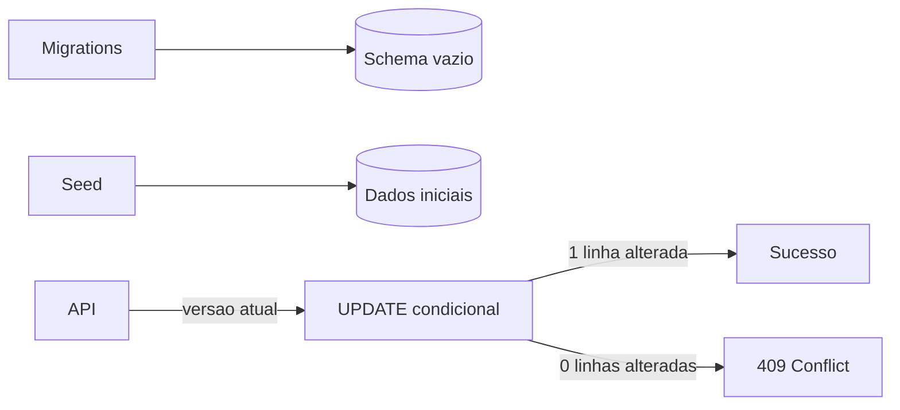

# Encontro 10

## Tema

Migrations, seeds e concorrência otimista com TypeORM e PostgreSQL.

## Objetivos

- Consolidar o uso de migrations em lugar de `synchronize`.
- Recriar o schema em um banco vazio de forma repetível.
- Preparar dados iniciais sem gerar duplicações.
- Diferenciar migration, seed e dado criado pela aplicação.
- Simular duas alterações concorrentes sobre a mesma solicitação.
- Detectar uma versão antiga e responder `409 Conflict`.
- Preparar a atividade de revisão do encontro 11.

## Ponto de partida

Continue no projeto do encontro 09. Ele deve possuir:

- PostgreSQL executado pelo Docker Compose;
- entidade `Solicitacao` persistida pelo TypeORM;
- `synchronize: false`;
- migrations configuradas e aplicadas;
- coluna `versao` na tabela de solicitações;
- aprovação e auditoria executadas na mesma transação.

Antes de continuar, confirme que a API inicia e que a tabela de migrations
possui os registros criados no encontro anterior.

## Resultado esperado



## Migration, seed e operação da API

| Mecanismo | Responsabilidade | Exemplo |
|---|---|---|
| migration | alterar a estrutura do banco | criar tabela ou coluna |
| seed | fornecer dados iniciais ou de demonstração | solicitações para o laboratório |
| API | executar o processo de negócio | criar e aprovar solicitação |

Uma migration não deve depender de um banco previamente alterado por
`synchronize`. Um seed precisa ser repetível: executá-lo duas vezes não deve
criar duas cópias de cada registro.

## Passo 1 — Conferir as migrations

Liste as migrations aplicadas:

```bash
docker compose run --rm api npm run typeorm -- migration:show
```

Confira também pelo PostgreSQL:

```bash
docker compose exec db psql -U app -d solicitacoes -c "SELECT id, timestamp, name FROM migrations ORDER BY id;"
```

As migrations devem aparecer como executadas. Se houver uma migration
pendente, aplique-a antes de criar o seed:

```bash
docker compose run --rm api npm run migration:run
```

## Passo 2 — Criar um seed repetível

Crie `src/database/seeds/solicitacoes.seed.ts`:

```ts
import 'dotenv/config';
import dataSource from '../data-source';
import { Solicitacao } from '../../solicitacoes/solicitacao.entity';

const dados = [
  {
    titulo: 'Aquisição de monitor',
    centroCusto: 'TI-DEV',
    prioridade: 'normal' as const,
  },
  {
    titulo: 'Substituição de servidor',
    centroCusto: 'TI-INFRA',
    prioridade: 'urgente' as const,
  },
];

async function executar() {
  await dataSource.initialize();
  const repository = dataSource.getRepository(Solicitacao);

  for (const item of dados) {
    const existente = await repository.findOneBy({ titulo: item.titulo });

    if (!existente) {
      await repository.save(
        repository.create({
          ...item,
          status: 'pendente',
        }),
      );
    }
  }

  await dataSource.destroy();
}

executar().catch(async (erro) => {
  console.error(erro);

  if (dataSource.isInitialized) {
    await dataSource.destroy();
  }

  process.exitCode = 1;
});
```

O exemplo usa o título para evitar duplicação no laboratório. Em um sistema
real, prefira uma chave natural estável ou um identificador conhecido pelo
seed, apoiado por uma restrição `UNIQUE` quando a regra exigir unicidade.

Adicione a `package.json`:

```json
{
  "seed": "ts-node src/database/seeds/solicitacoes.seed.ts"
}
```

Combine essa entrada com os scripts existentes. Execute duas vezes:

```bash
docker compose run --rm api npm run seed
docker compose run --rm api npm run seed
```

Depois, consulte:

```bash
docker compose exec db psql -U app -d solicitacoes -c "SELECT id, titulo, centro_custo, prioridade, status, versao FROM solicitacoes ORDER BY id;"
```

Cada item do seed deve aparecer apenas uma vez.

## Passo 3 — Recriar o banco a partir do zero

Este passo apaga somente o banco local do laboratório:

```bash
docker compose down --volumes
docker compose up -d db
docker compose run --rm api npm run migration:run
docker compose run --rm api npm run seed
docker compose up -d api
```

> Não execute `down --volumes` em um ambiente com dados que precisem ser
> preservados. O objetivo aqui é comprovar que schema e dados iniciais podem ser
> reconstruídos usando arquivos versionados.

Teste a listagem. As solicitações do seed devem estar disponíveis mesmo sem
`synchronize`.

## Passo 4 — Observar a concorrência

Consulte uma solicitação pendente e anote:

```json
{
  "id": 1,
  "status": "pendente",
  "versao": 1
}
```

Imagine que dois gestores, Ana e Carlos, consultaram essa mesma versão. Os
dois clientes tentarão aprovar com o corpo:

```json
{
  "versao": 1
}
```

Envie a primeira requisição com o token de gestor. Ela deve retornar `200` e
incrementar a versão. Sem consultar novamente, repita a requisição com a
versão antiga. Ela deve retornar `409 Conflict`.

O comportamento depende de a versão participar da condição da escrita:

```sql
UPDATE solicitacoes
SET status = 'aprovada', versao = versao + 1
WHERE id = $1
  AND versao = $2
  AND status = 'pendente';
```

Se nenhuma linha for alterada, o estado usado pelo cliente deixou de ser o
estado atual. A API não deve sobrescrever silenciosamente a primeira decisão.

## Passo 5 — Conferir a auditoria

Depois das duas tentativas, consulte:

```bash
docker compose exec db psql -U app -d solicitacoes -c "SELECT ator_id, acao, recurso_id, detalhes, criada_em FROM auditorias ORDER BY id;"
```

Deve existir uma auditoria para a alteração confirmada. A tentativa rejeitada
por conflito não deve criar outra evidência de aprovação.

## Testes

| Cenário | Resultado esperado |
|---|---|
| migrations em banco vazio | schema criado sem `synchronize` |
| primeira execução do seed | dados iniciais inseridos |
| segunda execução do seed | nenhuma duplicação |
| primeira escrita com versão atual | `200`, versão incrementada |
| segunda escrita com versão antiga | `409`, estado preservado |
| consulta da auditoria | uma evidência para a decisão confirmada |

## Erros comuns

### Usar seed para alterar o schema

Estrutura pertence às migrations. Seed prepara dados.

### Depender de ids gerados anteriormente

Depois de recriar o banco, sequências e ids podem mudar. Use uma referência
estável quando outros dados dependerem do seed.

### Executar somente uma leitura antes do `save`

Ler a versão e depois salvar sem condição permite alteração concorrente entre
as duas operações. A versão deve fazer parte do `UPDATE`.

### Transformar conflito em erro interno

Versão antiga é um conflito conhecido e deve produzir `409`, não `500`.

## Questões para revisão

1. Qual é a diferença entre migration e seed?
2. Por que um seed deve ser repetível?
3. O que comprova a reconstrução do banco vazio?
4. Por que a versão precisa participar da condição do `UPDATE`?
5. Por que a segunda alteração recebe `409`?
6. Quantas auditorias devem existir para duas tentativas concorrentes?

## Checklist de aprendizagem

- Executei as migrations em um banco vazio.
- Criei e repeti o seed sem duplicar dados.
- Mantive `synchronize` desativado.
- Simulei duas alterações com a mesma versão.
- Observei sucesso na primeira e conflito na segunda.
- Confirmei o estado final e a auditoria no PostgreSQL.

## Resumo final

As migrations tornaram o schema reproduzível, enquanto o seed preparou dados
iniciais de forma repetível. O teste com dois clientes mostrou por que a versão
precisa participar da escrita: a primeira decisão é confirmada e a segunda,
baseada em estado antigo, é rejeitada. No encontro 11, esses conhecimentos serão
reunidos em uma atividade prática de revisão.

## Material complementar

- TypeORM Migrations: https://typeorm.io/docs/advanced-topics/migrations
- TypeORM Transactions: https://typeorm.io/docs/advanced-topics/transactions
- TypeORM Update Query Builder: https://typeorm.io/docs/query-builder/update-query-builder
- PostgreSQL Concurrency Control: https://www.postgresql.org/docs/current/mvcc.html
