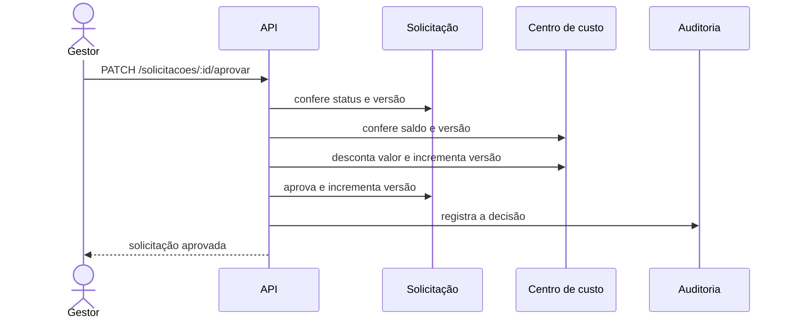

# Encontro 13 — Correção da Prática 2

## Tema

Implementação passo a passo da aprovação de uma solicitação com reserva de
orçamento, transação, auditoria e controle de concorrência.

## Objetivos

- Implementar a solução proposta na atividade do encontro 12.
- Evoluir o banco com uma migration reversível.
- Criar um seed identificado e repetível.
- Consultar o saldo e a versão de um centro de custo.
- Aprovar uma solicitação e reservar seu orçamento na mesma transação.
- Impedir saldo negativo e decisões baseadas em versões antigas.
- Registrar a aprovação em uma trilha de auditoria.
- Testar sucesso, autorização, saldo insuficiente, concorrência e rollback.

## Ponto de partida

Continue no projeto desenvolvido até o encontro 12. Ele deve possuir:

- autenticação JWT e autorização por papéis;
- PostgreSQL e TypeORM com `synchronize: false`;
- entidade `Solicitacao` com status e versão;
- entidade `Auditoria`;
- migrations e seed configurados;
- rota de aprovação protegida pelo papel `gestor`.

Nesta correção, os valores monetários serão armazenados como centavos inteiros.
Assim, R$ 1.200,00 será representado por `120000`, evitando cálculos com
ponto flutuante.

## Resultado esperado



As três gravações finais devem ocorrer na mesma transação. Uma falha em
qualquer etapa desfaz todas as anteriores.

## Passo 1 — Criar a entidade de centro de custo

Crie `src/centros-custo/centro-custo.entity.ts`:

```ts
import { Column, Entity, PrimaryColumn, VersionColumn } from 'typeorm';

@Entity({ name: 'centros_custo' })
export class CentroCusto {
  @PrimaryColumn({ type: 'varchar', length: 30 })
  codigo: string;

  @Column({ type: 'varchar', length: 100 })
  nome: string;

  @Column({ name: 'saldo_disponivel_centavos', type: 'integer' })
  saldoDisponivelCentavos: number;

  @VersionColumn({ name: 'versao' })
  versao: number;
}
```

O código identifica o centro de custo. O saldo informa quanto ainda pode ser
reservado e a versão muda sempre que o registro é atualizado.

## Passo 2 — Adicionar o valor estimado à solicitação

Em `src/solicitacoes/solicitacao.entity.ts`, preserve os campos existentes e
adicione:

```ts
@Column({ name: 'valor_estimado_centavos', type: 'integer' })
valorEstimadoCentavos: number;
```

O campo criado anteriormente continua guardando o código do centro:

```ts
@Column({ name: 'centro_custo', type: 'varchar', length: 30 })
centroCusto: string;
```

Registre a nova entidade no `data-source.ts` usado pela CLI e na configuração
global do TypeORM:

```ts
import { CentroCusto } from '../centros-custo/centro-custo.entity';

entities: [Solicitacao, Auditoria, CentroCusto],
```

Adapte o caminho do import à estrutura do projeto.

## Passo 3 — Criar a migration

Gere uma migration:

```bash
docker compose run --rm api npm run migration:generate -- src/database/migrations/AdicionarCentroCustoEOrcamento
```

Confira o arquivo gerado. Uma versão explícita pode seguir esta estrutura:

```ts
import { MigrationInterface, QueryRunner } from 'typeorm';

export class AdicionarCentroCustoEOrcamento1700000000000
  implements MigrationInterface
{
  name = 'AdicionarCentroCustoEOrcamento1700000000000';

  public async up(queryRunner: QueryRunner): Promise<void> {
    await queryRunner.query(\`
      CREATE TABLE "centros_custo" (
        "codigo" varchar(30) NOT NULL,
        "nome" varchar(100) NOT NULL,
        "saldo_disponivel_centavos" integer NOT NULL,
        "versao" integer NOT NULL DEFAULT 1,
        CONSTRAINT "CHK_centros_custo_saldo"
          CHECK ("saldo_disponivel_centavos" >= 0),
        CONSTRAINT "PK_centros_custo" PRIMARY KEY ("codigo")
      )
    \`);

    await queryRunner.query(\`
      ALTER TABLE "solicitacoes"
      ADD "valor_estimado_centavos" integer NOT NULL DEFAULT 0
    \`);

    await queryRunner.query(\`
      ALTER TABLE "solicitacoes"
      ADD CONSTRAINT "CHK_solicitacoes_valor_estimado"
      CHECK ("valor_estimado_centavos" >= 0)
    \`);

    await queryRunner.query(\`
      INSERT INTO "centros_custo"
        ("codigo", "nome", "saldo_disponivel_centavos", "versao")
      SELECT DISTINCT "centro_custo", "centro_custo", 0, 1
      FROM "solicitacoes"
      WHERE "centro_custo" IS NOT NULL
      ON CONFLICT ("codigo") DO NOTHING
    \`);

    await queryRunner.query(\`
      ALTER TABLE "solicitacoes"
      ADD CONSTRAINT "FK_solicitacoes_centro_custo"
      FOREIGN KEY ("centro_custo")
      REFERENCES "centros_custo"("codigo")
      ON UPDATE CASCADE
      ON DELETE RESTRICT
    \`);
  }

  public async down(queryRunner: QueryRunner): Promise<void> {
    await queryRunner.query(\`
      ALTER TABLE "solicitacoes"
      DROP CONSTRAINT "FK_solicitacoes_centro_custo"
    \`);
    await queryRunner.query(\`
      ALTER TABLE "solicitacoes"
      DROP CONSTRAINT "CHK_solicitacoes_valor_estimado"
    \`);
    await queryRunner.query(\`
      ALTER TABLE "solicitacoes"
      DROP COLUMN "valor_estimado_centavos"
    \`);
    await queryRunner.query('DROP TABLE "centros_custo"');
  }
}
```

Substitua o número da classe pelo timestamp do arquivo gerado. A inserção
intermediária cria os centros referenciados por dados antigos antes da chave
estrangeira, evitando que a migration falhe em um banco já preenchido.

Aplique e confira:

```bash
docker compose run --rm api npm run migration:run
docker compose run --rm api npm run typeorm -- migration:show
```

## Passo 4 — Atualizar o DTO e a criação de solicitações

Em `src/solicitacoes/dto/criar-solicitacao.dto.ts`, acrescente:

```ts
import { IsInt, Min } from 'class-validator';

@IsInt()
@Min(0)
valorEstimadoCentavos: number;
```

Combine os imports com os validadores existentes. No método `criar` do
`SolicitacoesService`, copie o novo campo:

```ts
const solicitacao = this.repository.create({
  titulo: dto.titulo,
  centroCusto: dto.centroCusto,
  prioridade: dto.prioridade,
  valorEstimadoCentavos: dto.valorEstimadoCentavos,
  status: 'pendente',
});

return this.repository.save(solicitacao);
```

## Passo 5 — Criar o seed da atividade

Atualize o seed para criar primeiro o centro de custo e depois as duas
solicitações. Troque `1234` pelos quatro últimos dígitos da matrícula.

```ts
import 'dotenv/config';
import dataSource from '../data-source';
import { CentroCusto } from '../../centros-custo/centro-custo.entity';
import { Solicitacao } from '../../solicitacoes/solicitacao.entity';

const codigoCentroCusto = 'CC-1234';

async function executar() {
  await dataSource.initialize();

  const centros = dataSource.getRepository(CentroCusto);
  const solicitacoes = dataSource.getRepository(Solicitacao);

  const centroExistente = await centros.findOneBy({
    codigo: codigoCentroCusto,
  });

  if (!centroExistente) {
    await centros.save(
      centros.create({
        codigo: codigoCentroCusto,
        nome: 'Centro de custo da atividade',
        saldoDisponivelCentavos: 500000,
      }),
    );
  }

  const dados = [
    {
      titulo: 'Aquisição de monitor - prática 2',
      valorEstimadoCentavos: 120000,
    },
    {
      titulo: 'Aquisição de servidor - prática 2',
      valorEstimadoCentavos: 600000,
    },
  ];

  for (const item of dados) {
    const existente = await solicitacoes.findOneBy({
      titulo: item.titulo,
      centroCusto: codigoCentroCusto,
    });

    if (!existente) {
      await solicitacoes.save(
        solicitacoes.create({
          ...item,
          centroCusto: codigoCentroCusto,
          prioridade: 'normal',
          status: 'pendente',
        }),
      );
    }
  }

  await dataSource.destroy();
}

executar().catch(async (erro) => {
  console.error(erro);

  if (dataSource.isInitialized) {
    await dataSource.destroy();
  }

  process.exitCode = 1;
});
```

O seed não redefine o saldo quando o centro já existe. Assim, executá-lo outra
vez não restaura um orçamento já utilizado nem duplica os registros.

```bash
docker compose run --rm api npm run seed
docker compose run --rm api npm run seed
docker compose exec db psql -U app -d solicitacoes -c "SELECT * FROM centros_custo;"
docker compose exec db psql -U app -d solicitacoes -c "SELECT id, titulo, centro_custo, valor_estimado_centavos, status, versao FROM solicitacoes ORDER BY id;"
```

## Passo 6 — Implementar a consulta do centro de custo

Crie `src/centros-custo/centros-custo.service.ts`:

```ts
import { Injectable, NotFoundException } from '@nestjs/common';
import { InjectRepository } from '@nestjs/typeorm';
import { Repository } from 'typeorm';
import { CentroCusto } from './centro-custo.entity';

@Injectable()
export class CentrosCustoService {
  constructor(
    @InjectRepository(CentroCusto)
    private readonly repository: Repository<CentroCusto>,
  ) {}

  async buscarPorCodigo(codigo: string) {
    const centro = await this.repository.findOneBy({ codigo });

    if (!centro) {
      throw new NotFoundException('Centro de custo não encontrado');
    }

    return centro;
  }
}
```

Crie `src/centros-custo/centros-custo.controller.ts`:

```ts
import { Controller, Get, Param, UseGuards } from '@nestjs/common';
import { JwtAuthGuard } from '../auth/jwt-auth.guard';
import { CentrosCustoService } from './centros-custo.service';

@Controller('centros-custo')
export class CentrosCustoController {
  constructor(private readonly service: CentrosCustoService) {}

  @UseGuards(JwtAuthGuard)
  @Get(':codigo')
  buscarPorCodigo(@Param('codigo') codigo: string) {
    return this.service.buscarPorCodigo(codigo);
  }
}
```

Crie `src/centros-custo/centros-custo.module.ts`:

```ts
import { Module } from '@nestjs/common';
import { TypeOrmModule } from '@nestjs/typeorm';
import { CentroCusto } from './centro-custo.entity';
import { CentrosCustoController } from './centros-custo.controller';
import { CentrosCustoService } from './centros-custo.service';

@Module({
  imports: [TypeOrmModule.forFeature([CentroCusto])],
  controllers: [CentrosCustoController],
  providers: [CentrosCustoService],
})
export class CentrosCustoModule {}
```

Importe `CentrosCustoModule` no `AppModule`.

## Passo 7 — Atualizar o DTO de aprovação

Substitua `src/solicitacoes/dto/aprovar-solicitacao.dto.ts`:

```ts
import { IsInt, Min } from 'class-validator';

export class AprovarSolicitacaoDto {
  @IsInt()
  @Min(1)
  versaoSolicitacao: number;

  @IsInt()
  @Min(1)
  versaoCentroCusto: number;
}
```

O cliente envia apenas as versões consultadas. Ator, status, valor reservado e
saldo final são definidos pela aplicação.

## Passo 8 — Atualizar a rota de aprovação

No `SolicitacoesController`, mantenha os guards e passe as versões ao service:

```ts
type RequisicaoAutenticada = {
  user: { id: number; papel: string };
};

@UseGuards(JwtAuthGuard, RolesGuard)
@Roles('gestor')
@Patch(':id/aprovar')
aprovar(
  @Param('id', ParseIntPipe) id: number,
  @Body() dto: AprovarSolicitacaoDto,
  @Req() request: RequisicaoAutenticada,
) {
  return this.service.aprovar(
    id,
    dto.versaoSolicitacao,
    dto.versaoCentroCusto,
    request.user.id,
  );
}
```

Combine os decorators e o DTO com os imports já existentes.

## Passo 9 — Implementar a aprovação transacional

No `SolicitacoesService`, injete o `DataSource`:

```ts
constructor(
  @InjectRepository(Solicitacao)
  private readonly repository: Repository<Solicitacao>,
  private readonly dataSource: DataSource,
) {}
```

Acrescente os imports necessários:

```ts
import {
  ConflictException,
  Injectable,
  NotFoundException,
} from '@nestjs/common';
import { DataSource, Repository } from 'typeorm';
import { Auditoria } from '../auditoria/auditoria.entity';
import { CentroCusto } from '../centros-custo/centro-custo.entity';
```

Substitua o método de aprovação:

```ts
async aprovar(
  id: number,
  versaoSolicitacao: number,
  versaoCentroCusto: number,
  atorId: number,
) {
  return this.dataSource.transaction(async (manager) => {
    const solicitacao = await manager.findOneBy(Solicitacao, { id });

    if (!solicitacao) {
      throw new NotFoundException('Solicitação não encontrada');
    }
    if (solicitacao.status !== 'pendente') {
      throw new ConflictException('Solicitação não está pendente');
    }
    if (solicitacao.versao !== versaoSolicitacao) {
      throw new ConflictException(
        'A solicitação foi alterada; consulte novamente',
      );
    }

    const centro = await manager.findOneBy(CentroCusto, {
      codigo: solicitacao.centroCusto,
    });

    if (!centro) {
      throw new NotFoundException('Centro de custo não encontrado');
    }
    if (centro.versao !== versaoCentroCusto) {
      throw new ConflictException(
        'O centro de custo foi alterado; consulte novamente',
      );
    }
    if (
      centro.saldoDisponivelCentavos <
      solicitacao.valorEstimadoCentavos
    ) {
      throw new ConflictException('Saldo insuficiente');
    }

    const saldoAnterior = centro.saldoDisponivelCentavos;
    const saldoResultante =
      saldoAnterior - solicitacao.valorEstimadoCentavos;

    const atualizacaoCentro = await manager
      .createQueryBuilder()
      .update(CentroCusto)
      .set({
        saldoDisponivelCentavos: () =>
          '"saldo_disponivel_centavos" - :valor',
        versao: () => '"versao" + 1',
      })
      .where('"codigo" = :codigo', { codigo: centro.codigo })
      .andWhere('"versao" = :versaoCentroCusto', {
        versaoCentroCusto,
      })
      .andWhere('"saldo_disponivel_centavos" >= :valor')
      .setParameters({
        valor: solicitacao.valorEstimadoCentavos,
      })
      .execute();

    if (atualizacaoCentro.affected !== 1) {
      throw new ConflictException(
        'Saldo ou versão foi alterado; consulte novamente',
      );
    }

    const atualizacaoSolicitacao = await manager
      .createQueryBuilder()
      .update(Solicitacao)
      .set({
        status: 'aprovada',
        versao: () => '"versao" + 1',
      })
      .where('"id" = :id', { id })
      .andWhere('"versao" = :versaoSolicitacao', {
        versaoSolicitacao,
      })
      .andWhere('"status" = :status', { status: 'pendente' })
      .execute();

    if (atualizacaoSolicitacao.affected !== 1) {
      throw new ConflictException(
        'A solicitação foi alterada; consulte novamente',
      );
    }

    await manager.insert(Auditoria, {
      atorId,
      acao: 'SOLICITACAO_APROVADA_COM_RESERVA',
      recursoTipo: 'solicitacao',
      recursoId: solicitacao.id,
      detalhes: {
        centroCusto: centro.codigo,
        valorReservadoCentavos:
          solicitacao.valorEstimadoCentavos,
        saldoAnteriorCentavos: saldoAnterior,
        saldoResultanteCentavos: saldoResultante,
        versaoSolicitacaoUtilizada: versaoSolicitacao,
        versaoCentroCustoUtilizada: versaoCentroCusto,
      },
    });

    return manager.findOneByOrFail(Solicitacao, { id });
  });
}
```

Todas as operações usam o `manager` da transação. As verificações iniciais
produzem mensagens claras, enquanto as condições repetidas nos próprios
`UPDATE` impedem que uma mudança concorrente passe despercebida.

## Passo 10 — Conferir o módulo de solicitações

```ts
import { TypeOrmModule } from '@nestjs/typeorm';
import { Auditoria } from '../auditoria/auditoria.entity';
import { CentroCusto } from '../centros-custo/centro-custo.entity';
import { Solicitacao } from './solicitacao.entity';

@Module({
  imports: [
    TypeOrmModule.forFeature([
      Solicitacao,
      Auditoria,
      CentroCusto,
    ]),
  ],
  controllers: [SolicitacoesController],
  providers: [SolicitacoesService],
})
export class SolicitacoesModule {}
```

O `DataSource` é fornecido pela configuração global do TypeORM.

## Passo 11 — Executar o fluxo válido

```bash
docker compose up --build
```

Consulte o centro:

```http
GET /centros-custo/CC-1234
Authorization: Bearer TOKEN_DO_GESTOR
```

Consulte a solicitação de R$ 1.200,00 e anote seu `id` e sua versão. Depois:

```http
PATCH /solicitacoes/1/aprovar
Authorization: Bearer TOKEN_DO_GESTOR
Content-Type: application/json

{
  "versaoSolicitacao": 1,
  "versaoCentroCusto": 1
}
```

Se o saldo inicial era `500000`, o resultado esperado é:

- solicitação aprovada e com versão incrementada;
- centro de custo com saldo `380000` e versão incrementada;
- auditoria contendo ator, valor, saldos e versões.

```bash
docker compose exec db psql -U app -d solicitacoes -c "SELECT id, status, versao FROM solicitacoes ORDER BY id;"
docker compose exec db psql -U app -d solicitacoes -c "SELECT codigo, saldo_disponivel_centavos, versao FROM centros_custo;"
docker compose exec db psql -U app -d solicitacoes -c "SELECT ator_id, acao, recurso_id, detalhes FROM auditorias ORDER BY id;"
```

## Passo 12 — Testar saldo insuficiente

Consulte novamente o centro para obter a versão atual e tente aprovar a
solicitação de `600000` centavos. O resultado deve ser `409 Conflict`.

Depois da tentativa:

- a solicitação continua pendente;
- saldo e versões permanecem iguais;
- nenhuma auditoria de sucesso é criada.

## Passo 13 — Testar autorização

Repita a aprovação:

1. sem token: `401 Unauthorized`;
2. com usuário sem papel `gestor`: `403 Forbidden`;
3. com gestor: a requisição chega às regras de negócio.

O ator registrado deve vir do JWT, nunca do corpo.

## Passo 14 — Testar concorrência

Use uma solicitação pendente e um centro com saldo suficiente. Consulte ambos,
guarde suas versões e envie duas aprovações com os mesmos valores:

- a primeira deve concluir a reserva;
- a segunda deve retornar `409 Conflict`;
- o saldo deve ser descontado uma única vez;
- deve existir somente uma auditoria de sucesso.

Apenas um `UPDATE` encontra a versão esperada. A outra transação afeta zero
registros e é desfeita.

## Passo 15 — Comprovar o rollback

Temporariamente, antes de `manager.insert(Auditoria, ...)`, provoque uma falha:

```ts
throw new Error('Falha simulada antes da auditoria');
```

Execute uma aprovação válida e confira:

- a solicitação continua pendente;
- o saldo permanece igual;
- não existe auditoria de aprovação.

Remova a linha de teste depois da comprovação.

## Passo 16 — Recriar o banco

Estes comandos removem somente os volumes do ambiente local:

```bash
docker compose down --volumes
docker compose up -d db
docker compose run --rm api npm run migration:run
docker compose run --rm api npm run seed
docker compose up -d api
```

> Não remova volumes de um ambiente com dados que precisem ser preservados.

Repita a consulta do centro e uma aprovação. Isso comprova que schema e dados
iniciais não dependem de `synchronize` nem de alterações manuais.

## Lista de verificação

- [ ] a migration cria e reverte as alterações;
- [ ] valor e saldo não usam ponto flutuante;
- [ ] o banco impede valor e saldo negativos;
- [ ] a chave estrangeira impede centro de custo inexistente;
- [ ] o seed pode ser executado duas vezes sem duplicar dados;
- [ ] a consulta do centro exige JWT;
- [ ] somente gestores podem aprovar;
- [ ] ator, status e saldo final não vêm do corpo;
- [ ] desconto, aprovação e auditoria usam a mesma transação;
- [ ] os dois `UPDATE` verificam as versões;
- [ ] saldo insuficiente e versão antiga retornam `409`;
- [ ] uma falha provoca rollback completo;
- [ ] `.env`, tokens e credenciais não foram enviados ao Git.

## Síntese

A implementação combina as garantias de cada camada:

- o DTO valida a entrada;
- os guards autenticam e autorizam o gestor;
- o service aplica as regras do processo;
- os `UPDATE` condicionais detectam concorrência;
- a transação impede alterações parciais;
- as restrições do PostgreSQL preservam a integridade;
- a auditoria registra quem realizou a operação e seus efeitos.

A aprovação deixa de ser apenas uma mudança de status e se torna uma operação
de negócio persistente, atômica, segura e auditável.
