# Encontro 15 — Fundamentos de NoSQL

## Tema

Conceitos, modelos, fundamentos e operações com bancos de dados NoSQL.

## Objetivos

- Compreender o significado e as características de NoSQL.
- Reconhecer os principais modelos de bancos não relacionais.
- Comparar documentos, chave-valor, famílias de colunas e grafos.
- Modelar documentos de acordo com as consultas da aplicação.
- Configurar e utilizar o MongoDB em um ambiente local.
- Executar operações de criação, consulta, atualização e remoção.
- Criar índices, validações e consultas com agregação.
- Identificar benefícios, limitações e critérios de adoção.

Neste encontro, o MongoDB será utilizado diretamente pelo terminal. Ele ainda
não será adicionado ao projeto NestJS.

## O que significa NoSQL?

NoSQL reúne bancos de dados que não dependem exclusivamente do modelo
relacional de tabelas, linhas, colunas e junções. O termo costuma ser entendido
como *Not Only SQL*: não significa ausência de consulta ou de estrutura, mas a
existência de outros modelos para organizar e acessar dados.

Bancos NoSQL geralmente priorizam algumas destas características:

- estrutura flexível para registros com formatos diferentes;
- distribuição dos dados entre vários nós;
- leitura e escrita em grande volume;
- modelagem orientada às consultas mais frequentes;
- redução da necessidade de junções;
- expansão horizontal da infraestrutura.

Essas características não tornam NoSQL automaticamente melhor. A escolha
depende do formato dos dados, das consultas, das garantias de consistência, do
volume e da forma como o sistema será operado.

### Duas formas de observar o mesmo domínio

No modelo relacional, os dados costumam ser separados conforme suas entidades
e reunidos por relacionamentos:

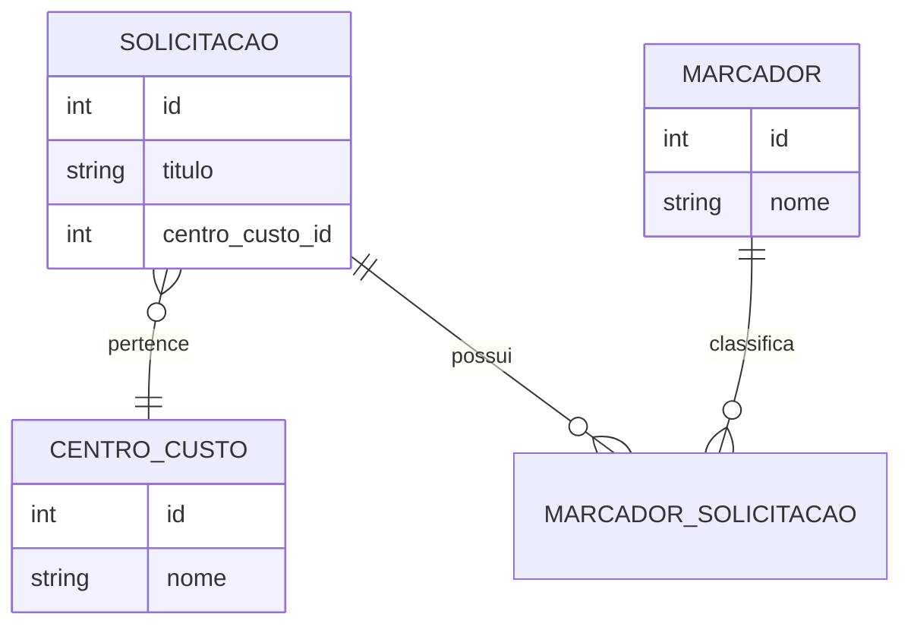

No modelo documental, informações lidas juntas podem ficar reunidas:

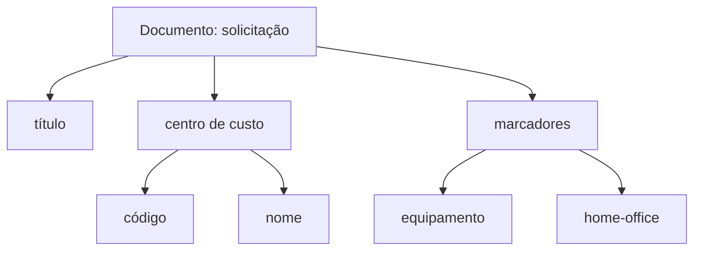

Não se trata apenas de trocar tabelas por JSON. A principal mudança é pensar
primeiro em **como o dado será acessado**. Se a tela sempre precisa da
solicitação, do centro e dos marcadores juntos, um documento pode representar
essa unidade de leitura. Se essas informações mudam separadamente e são
compartilhadas por muitos registros, separá-las pode ser mais adequado.

## Principais modelos

| Modelo | Organização | Exemplos de uso |
|---|---|---|
| Chave-valor | uma chave identifica um valor | sessão, cache, carrinho |
| Documental | documentos com campos e estruturas aninhadas | catálogo, perfil, conteúdo |
| Famílias de colunas | linhas distribuídas e colunas agrupadas | telemetria e grandes volumes |
| Grafos | vértices e relacionamentos | fraude, recomendação, redes |

Neste encontro será usado o modelo documental com MongoDB.

### Visualização dos quatro modelos

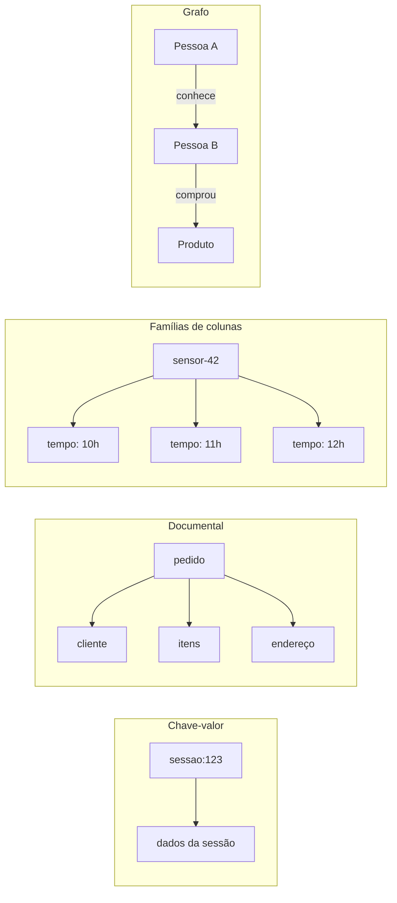

| Pergunta dominante | Modelo que merece ser investigado |
|---|---|
| “Qual valor corresponde a esta chave?” | chave-valor |
| “Como armazenar e recuperar este objeto completo?” | documental |
| “Como gravar grandes séries distribuídas por chave?” | famílias de colunas |
| “Quais caminhos e relações conectam estes elementos?” | grafo |

O modelo indicado pela pergunta ainda precisa ser avaliado diante de
consistência, operação, experiência da equipe e custo.

## Documento, coleção e banco

No MongoDB:

- um **banco** reúne coleções;
- uma **coleção** reúne documentos;
- um **documento** representa um registro;
- cada documento possui um campo `_id` único;
- documentos da mesma coleção podem ter campos diferentes.

Exemplo:

```javascript
{
  _id: ObjectId("..."),
  titulo: "Aquisição de monitor",
  status: "pendente",
  prioridade: "normal",
  centroCusto: {
    codigo: "TI-DEV",
    nome: "Desenvolvimento"
  },
  marcadores: ["equipamento", "home-office"],
  valorEstimadoCentavos: 120000,
  criadaEm: ISODate("2026-09-30T12:00:00Z")
}
```

O documento é semelhante a JSON, mas o MongoDB utiliza BSON, que oferece tipos
adicionais como `ObjectId`, datas, binários e números com representações
específicas.

### Hierarquia visual

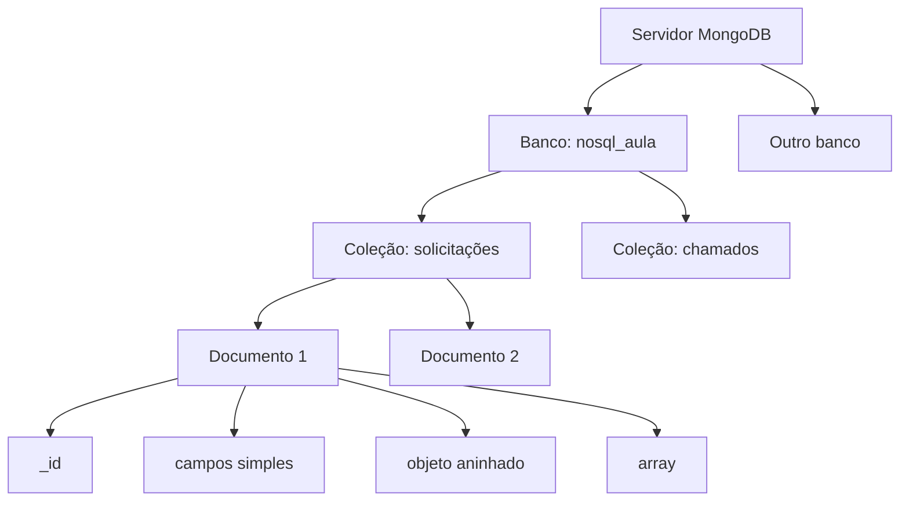

Uma coleção se aproxima da ideia de tabela somente como ponto de comparação.
Ela não obriga todos os documentos a possuírem exatamente as mesmas
propriedades. Essa flexibilidade deve ser controlada por regras de domínio e
validação, não confundida com ausência de modelagem.

### Evolução de formatos

Uma coleção pode conter documentos produzidos em momentos diferentes:

| Documento | Campos particulares | Interpretação |
|---|---|---|
| solicitação antiga | título e centro de custo | formato inicial |
| solicitação atual | título, centro, marcadores e prioridade | formato ampliado |
| solicitação importada | título, origem externa e protocolo | dado vindo de integração |

A aplicação precisa saber como tratar campos ausentes e versões antigas. A
flexibilidade reduz migrations estruturais em alguns casos, mas transfere parte
da responsabilidade para leitura, validação e manutenção dos documentos.

## Estruturas aninhadas ou referências

Dados acessados e atualizados juntos podem ser incorporados ao documento:

```javascript
centroCusto: {
  codigo: "TI-DEV",
  nome: "Desenvolvimento"
}
```

Quando uma informação possui ciclo de vida próprio, é muito compartilhada ou
cresce sem limite, pode ser melhor guardar uma referência:

```javascript
{
  titulo: "Aquisição de monitor",
  centroCustoId: ObjectId("...")
}
```

O MongoDB não realiza automaticamente as mesmas garantias de uma chave
estrangeira relacional. A aplicação precisa lidar conscientemente com
referências inexistentes ou desatualizadas.

### Exemplo sem código: pedido e endereço

Considere uma loja. O endereço usado na entrega deve permanecer como estava no
momento da compra, mesmo que o cliente altere depois seu endereço principal.
Nesse caso, incorporar uma cópia do endereço ao pedido preserva o histórico.

Por outro lado, o cadastro do cliente possui identidade própria e é consultado
por muitos processos. Ele pode continuar separado e ser indicado por uma
referência.

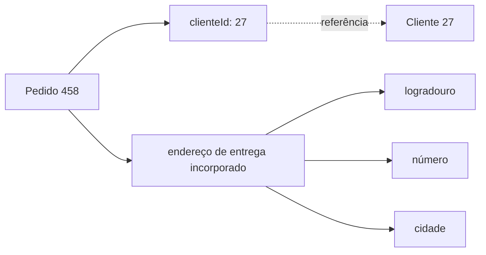

| Critério | Incorporar | Referenciar |
|---|---|---|
| leitura conjunta | favorece | pode exigir nova consulta |
| atualização independente | pode duplicar alterações | favorece |
| histórico imutável | favorece | exige cuidado |
| conteúdo compartilhado | pode gerar duplicação | favorece |
| crescimento sem limite | deve ser evitado | favorece separação |
| garantia automática entre registros | não existe | também não equivale a uma FK |

### Roteiro de decisão

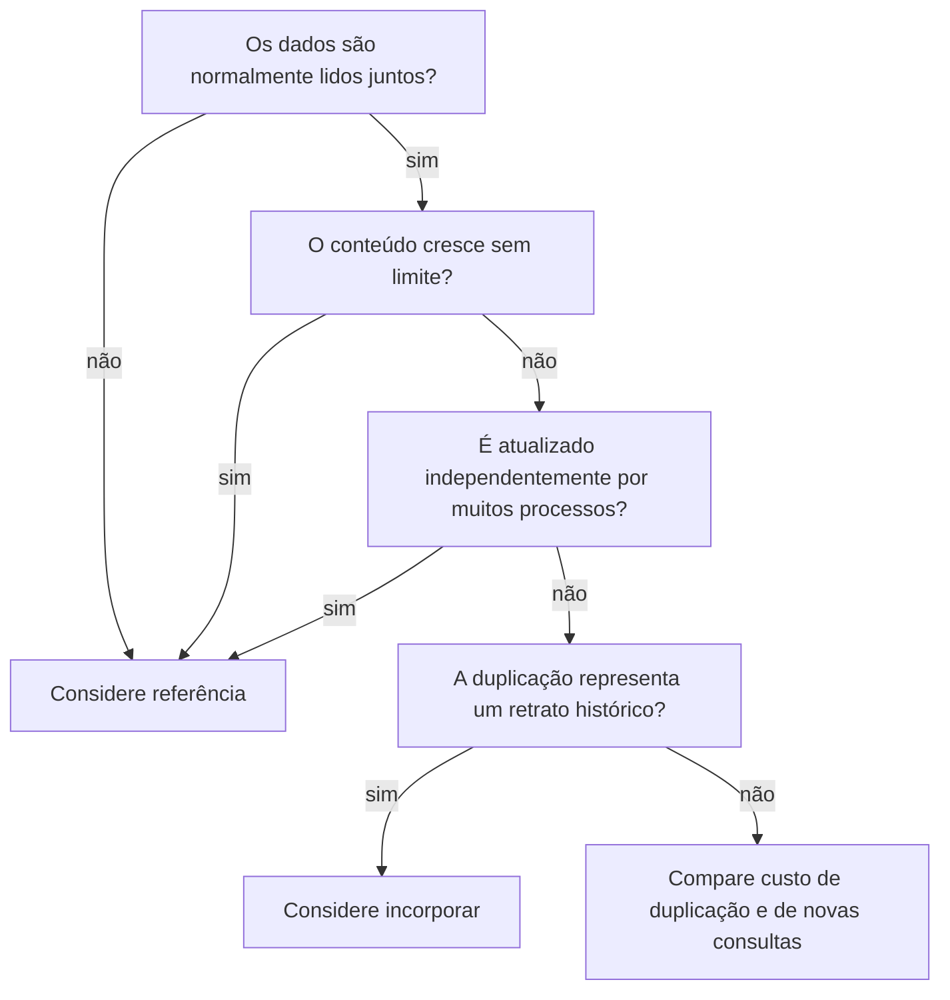

## Configuração do laboratório

Crie uma pasta separada para o experimento e use o seguinte
`compose.yaml`:

```yaml
services:
  mongo:
    image: mongo:8
    environment:
      MONGO_INITDB_ROOT_USERNAME: admin
      MONGO_INITDB_ROOT_PASSWORD: admin
    ports:
      - "27017:27017"
    volumes:
      - mongo_data:/data/db

volumes:
  mongo_data:
```

As credenciais são apenas para o laboratório local. Em outros ambientes,
utilize segredos próprios e não publique senhas no repositório.

Inicie o banco:

```bash
docker compose up -d
docker compose ps
```

Abra o shell do MongoDB:

```bash
docker compose exec mongo mongosh -u admin -p admin --authenticationDatabase admin
```

Selecione o banco do laboratório:

```javascript
use nosql_aula
```

O banco e a coleção são materializados quando o primeiro documento é gravado.

## Inserção de documentos

Insira um documento:

```javascript
db.solicitacoes.insertOne({
  titulo: "Aquisição de monitor",
  status: "pendente",
  prioridade: "normal",
  centroCusto: {
    codigo: "TI-DEV",
    nome: "Desenvolvimento"
  },
  marcadores: ["equipamento", "home-office"],
  valorEstimadoCentavos: 120000,
  criadaEm: new Date()
})
```

Insira vários:

```javascript
db.solicitacoes.insertMany([
  {
    titulo: "Renovação de licenças",
    status: "aprovada",
    prioridade: "normal",
    centroCusto: { codigo: "TI-DEV", nome: "Desenvolvimento" },
    marcadores: ["software"],
    valorEstimadoCentavos: 80000,
    criadaEm: new Date()
  },
  {
    titulo: "Substituição de servidor",
    status: "pendente",
    prioridade: "urgente",
    centroCusto: { codigo: "TI-INFRA", nome: "Infraestrutura" },
    marcadores: ["equipamento", "datacenter"],
    valorEstimadoCentavos: 900000,
    criadaEm: new Date()
  }
])
```

## Consultas

Liste todos os documentos:

```javascript
db.solicitacoes.find()
```

Filtre por igualdade e por campo aninhado:

```javascript
db.solicitacoes.find({ status: "pendente" })

db.solicitacoes.find({
  "centroCusto.codigo": "TI-DEV"
})
```

Use operadores:

```javascript
db.solicitacoes.find({
  valorEstimadoCentavos: { $gte: 100000 }
})

db.solicitacoes.find({
  status: "pendente",
  prioridade: { $in: ["normal", "urgente"] }
})
```

Escolha os campos retornados:

```javascript
db.solicitacoes.find(
  { status: "pendente" },
  { titulo: 1, prioridade: 1, valorEstimadoCentavos: 1 }
)
```

Ordene e limite:

```javascript
db.solicitacoes
  .find({ status: "pendente" })
  .sort({ valorEstimadoCentavos: -1 })
  .limit(5)
```

## Atualização e remoção

```javascript
db.solicitacoes.updateOne(
  { titulo: "Aquisição de monitor", status: "pendente" },
  {
    $set: { prioridade: "urgente" },
    $addToSet: { marcadores: "priorizada" }
  }
)

db.solicitacoes.deleteOne({
  titulo: "Registro criado apenas para teste"
})
```

`$set` altera campos específicos. `$addToSet` adiciona um item ao array sem
repeti-lo. Uma atualização sem filtro adequado pode modificar o documento
errado; antes de atualizar, execute o mesmo filtro com `find`.

## Índices

Sem índice, o banco pode precisar examinar toda a coleção. Crie um índice para
uma consulta frequente:

```javascript
db.solicitacoes.createIndex({
  status: 1,
  "centroCusto.codigo": 1
})
```

Confira os índices e o plano:

```javascript
db.solicitacoes.getIndexes()

db.solicitacoes
  .find({ status: "pendente", "centroCusto.codigo": "TI-DEV" })
  .explain("executionStats")
```

Índices aceleram leituras, mas ocupam espaço e aumentam o custo das escritas.
Devem ser definidos a partir das consultas reais.

### Analogia do índice

Uma coleção sem índice se aproxima de procurar um assunto lendo todos os livros
da biblioteca. Um índice se aproxima de consultar o catálogo para localizar
apenas as estantes e os livros relevantes.

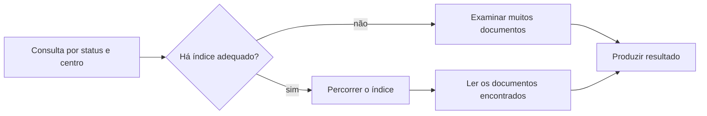

| Situação | Efeito provável |
|---|---|
| leitura frequente sem índice | maior tempo de busca |
| índice alinhado ao filtro e à ordenação | menos documentos examinados |
| muitos índices | mais armazenamento e escrita mais cara |
| índice que não corresponde às consultas | custo sem benefício relevante |

## Agregação

O pipeline de agregação processa documentos em etapas. Para somar os valores
por centro de custo:

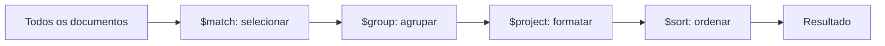

Cada etapa recebe a saída da anterior. A ordem importa: reduzir o conjunto logo
no início normalmente evita processamento desnecessário nas etapas seguintes.

```javascript
db.solicitacoes.aggregate([
  {
    $group: {
      _id: "$centroCusto.codigo",
      quantidade: { $sum: 1 },
      totalCentavos: { $sum: "$valorEstimadoCentavos" }
    }
  },
  { $sort: { totalCentavos: -1 } }
])
```

`$match`, `$group`, `$project`, `$sort` e `$limit` são etapas comuns.
Quando possível, filtre no início do pipeline para reduzir o volume processado.

## Validação da coleção

Flexibilidade não significa ausência de regras. Crie uma coleção com validação:

```javascript
db.createCollection("solicitacoes_validadas", {
  validator: {
    $jsonSchema: {
      bsonType: "object",
      required: [
        "titulo",
        "status",
        "valorEstimadoCentavos"
      ],
      properties: {
        titulo: {
          bsonType: "string",
          minLength: 5
        },
        status: {
          enum: ["pendente", "aprovada", "rejeitada"]
        },
        valorEstimadoCentavos: {
          bsonType: "int",
          minimum: 0
        }
      }
    }
  }
})
```

As regras protegem o banco contra documentos inválidos, inclusive quando os
dados são inseridos fora da aplicação.

## Distribuição, consistência e disponibilidade

Bancos NoSQL podem usar replicação e particionamento para atender volume,
disponibilidade e distribuição geográfica. Essas decisões envolvem:

- quantas cópias do dado existem;
- quando uma escrita é considerada confirmada;
- de qual réplica uma leitura pode ser feita;
- como falhas de rede são tratadas;
- como os dados são divididos entre os nós.

O MongoDB oferece replica sets, preferência de leitura, write concern e
sharding. Essas configurações devem ser escolhidas conforme os requisitos; não
são apenas opções de desempenho.

### Replicação e particionamento

Replicação mantém cópias dos mesmos dados:

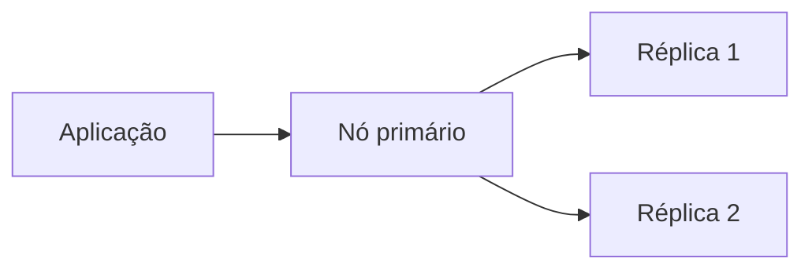

Particionamento distribui subconjuntos dos dados:

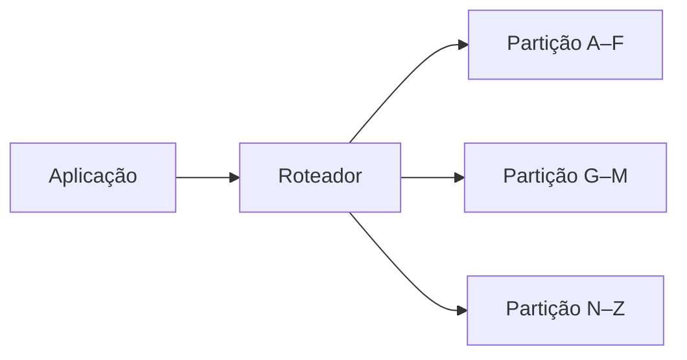

| Mecanismo | Problema principal atendido | Nova preocupação |
|---|---|---|
| replicação | disponibilidade e redundância | atraso entre cópias e eleição |
| particionamento | volume e distribuição de carga | escolha da chave e rebalanceamento |

### Consistência diante de uma falha de rede

Quando nós distribuídos deixam de se comunicar, o sistema precisa decidir como
responder. De forma simplificada:

| Prioridade durante a falha | Consequência |
|---|---|
| preservar consistência | algumas operações podem ser recusadas |
| preservar disponibilidade | respostas podem refletir versões diferentes |

O chamado teorema CAP não significa escolher livremente apenas duas letras em
qualquer situação. Ele chama atenção para o comportamento do sistema
distribuído quando existe uma partição de rede. A decisão concreta também
depende das configurações de leitura, confirmação de escrita e do requisito de
cada operação.

## Quando considerar NoSQL

NoSQL pode ser adequado quando:

- os documentos possuem estrutura variável;
- objetos completos são lidos juntos;
- há grande volume de operações simples;
- a distribuição horizontal é uma necessidade real;
- relacionamentos e junções não dominam as consultas.

Ele exige cuidado quando:

- muitas regras dependem de relacionamentos entre registros;
- transações abrangentes são frequentes;
- relatórios usam muitas combinações de dados;
- duplicações precisam ser sincronizadas constantemente;
- a equipe não domina o modelo operacional do banco.

### Matriz de cenários

| Cenário | Características | Direção inicial para análise |
|---|---|---|
| cadastro financeiro | regras fortes, relações e transações | relacional |
| catálogo com atributos variados | leitura do item completo e campos diferentes | documental |
| sessão temporária | acesso direto por identificador e expiração | chave-valor |
| detecção de fraude | exploração de relações e caminhos | grafo |
| telemetria de milhões de dispositivos | escrita distribuída por chave e tempo | famílias de colunas |
| relatório que cruza muitas entidades | combinações e agregações relacionais | relacional |

Essa tabela não substitui uma análise. Ela oferece um ponto de partida para
formular perguntas e construir um pequeno experimento antes da adoção.

### Perguntas antes de escolher

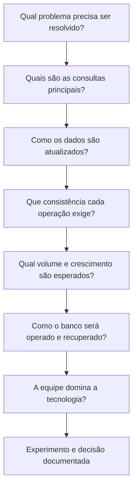

## Exercício

Modele uma coleção `chamados` para atendimento interno. Cada documento deve
possuir solicitante, categoria, prioridade, descrição, marcadores, histórico de
mudanças e datas.

Depois:

1. insira pelo menos cinco documentos com estruturas ligeiramente diferentes;
2. consulte chamados abertos por categoria;
3. filtre chamados que possuam determinado marcador;
4. atualize a prioridade de um chamado;
5. acrescente uma entrada ao histórico;
6. crie um índice para a consulta mais frequente;
7. produza uma agregação com a quantidade de chamados por categoria;
8. explique quais dados foram incorporados e quais poderiam virar referências.

## Síntese

NoSQL oferece modelos diferentes do relacional, mas continua exigindo
modelagem, validação, índices, segurança e decisões de consistência. O formato
dos documentos deve nascer das consultas e dos padrões de atualização, não
apenas da aparência do JSON.
