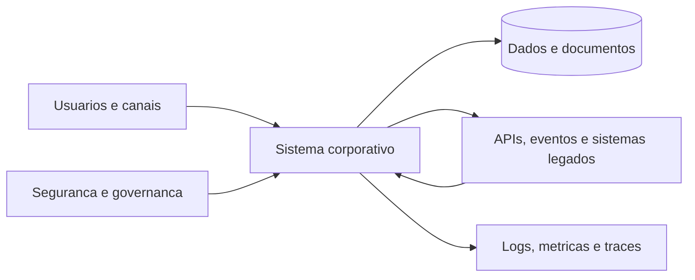

# Visão Geral da Disciplina

## O que é um sistema corporativo?

É um sistema que sustenta processos relevantes de uma organização e conecta
pessoas, regras, dados e outros sistemas. Além de “funcionar”, precisa preservar
segurança, disponibilidade, integridade, rastreabilidade, interoperabilidade e
capacidade de evolução durante muitos anos.

## Relação com Desenvolvimento Web Backend

A disciplina anterior construíram a base: fluxo
cliente-servidor, HTTP, NestJS, módulos, controllers, services, rotas, DTOs,
validação, erros, formulários, upload, cookies e sessão. Esta disciplina começa
com uma síntese dessa base e retoma a trilha no ponto seguinte: autenticação e
autorização, persistência, testes, deploy e operação.

## Competências

1. Traduzir processos e regras organizacionais em módulos de software.
2. Selecionar estilos arquiteturais segundo contexto e trade-offs.
3. Implementar segurança, transações e integrações confiáveis.
4. Automatizar testes, build, configuração e implantação.
5. Instrumentar o sistema e investigar falhas em produção.
6. Comunicar decisões e riscos técnicos a públicos distintos.

## Produto integrador

Uma solução corporativa com domínio não trivial, autenticação e papéis,
persistência relacional, integração assíncrona, auditoria, testes, documentação,
contêineres, CI e observabilidade mínima.
